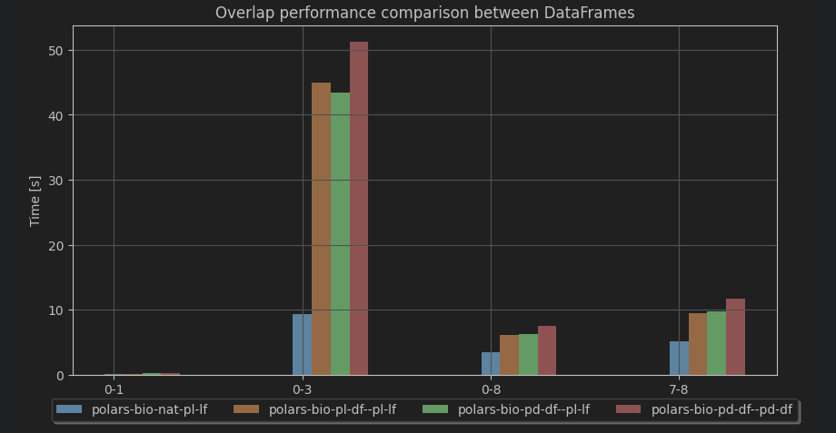

# polars_bio

## Features


## Genomic ranges operations

| Features     | Bioframe           | polars-bio          | PyRanges           | Pybedtools         | PyGenomics         | GenomicRanges      |
|--------------|--------------------|---------------------|--------------------|--------------------|--------------------|--------------------|
| overlap      | :white_check_mark: | :white_check_mark:  | :white_check_mark: | :white_check_mark: | :white_check_mark: | :white_check_mark: |
| nearest      | :white_check_mark: | :white_check_mark:  | :white_check_mark: |                    |                    |                    |
| cluster      | :white_check_mark: |                     |                    |                    |                    |                    |
| merge        | :white_check_mark: |                     |                    |                    |                    |                    |
| complement   | :white_check_mark: |                     |                    |                    |                    |                    |
| select/slice | :white_check_mark: |                     |                    |                    |                    |                    |
|              |                    |                     |                    |                    |                    |                    |
| coverage     | :white_check_mark: |                     |                    |                    |                    |                    |
| expand       | :white_check_mark: |                     |                    |                    |                    |                    |
| sort         | :white_check_mark: |                     |                    |                    |                    |                    |


## Input/Output
| I/O              | Bioframe           | polars-bio             | PyRanges           | Pybedtools | PyGenomics | GenomicRanges |
|------------------|--------------------|------------------------|--------------------|------------|------------|---------------|
| Pandas DataFrame | :white_check_mark: | :white_check_mark:     | :white_check_mark: |            |            |               |
| Polars DataFrame |                    | :white_check_mark:     |                    |            |            |               |
| Polars LazyFrame |                    | :white_check_mark:     |                    |            |            |               |
| Native readers   |                    | :white_check_mark:     |                    |            |            |               |


## Genomic file format
| I/O            | Bioframe           | polars-bio | PyRanges           | Pybedtools | PyGenomics | GenomicRanges |
|----------------|--------------------|------------|--------------------|------------|------------|---------------|
| BED            | :white_check_mark: |            | :white_check_mark: |            |            |               |
| BAM            |                    |            |                    |            |            |               |
| VCF            |                    |            |                    |            |            |               |


## Performance





## Remarks

Pyranges is multithreaded, but :

* Requires Ray backend plus
```bash
  nb_cpu: int, default 1

            How many cpus to use. Can at most use 1 per chromosome or chromosome/strand tuple.
            Will only lead to speedups on large datasets.
```

* for nearest returns no empty rows if there is no overlap (we follow Bioframe where nulls are returned)
#