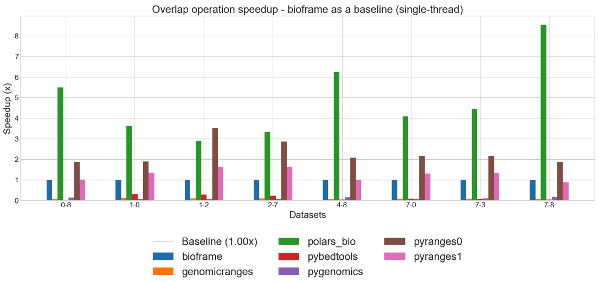
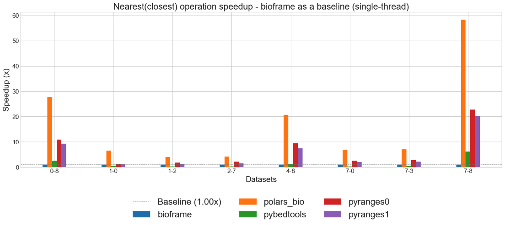
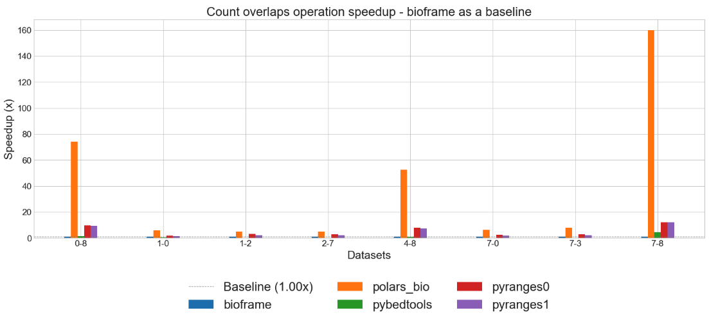
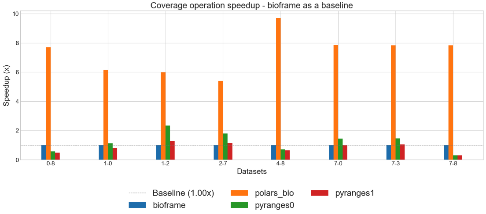
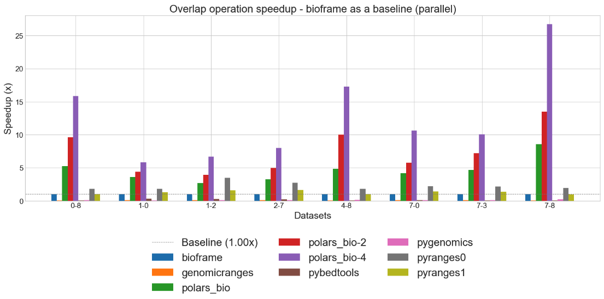
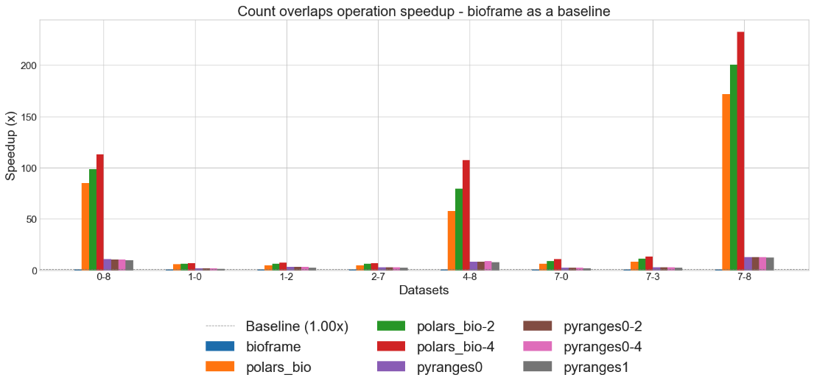
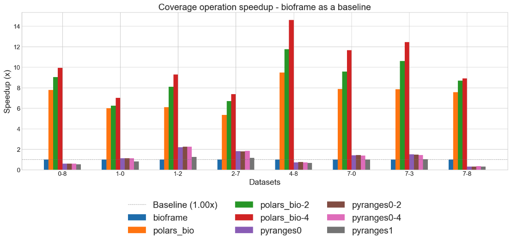

# Next-gen Python DataFrame operations for genomics!

{ align=center style="height:350px;width:350px" }


polars-bio is a :rocket:blazing [fast](performance.md#results-summary-) Python DataFrame library for genomics🧬  built on top of [Apache DataFusion](https://datafusion.apache.org/), [Apache Arrow](https://arrow.apache.org/)
and  [polars](https://pola.rs/).
It is designed to be easy to use, fast and memory efficient with a focus on genomics data.


## Key Features
* optimized for [peformance](performance.md#results-summary-) and memory [efficiency](performance.md#memory-characteristics) for large-scale genomics datasets analyses both when reading input data and performing operations
* popular genomics [operations](features.md#genomic-ranges-operations) with a DataFrame API (both [Pandas](https://pandas.pydata.org/) and [polars](https://pola.rs/))
* [SQL](features.md#sql-powered-data-processing)-powered bioinformatic data querying or manipulation/pre-processing
* native parallel engine powered by Apache DataFusion and [sequila-native](https://github.com/biodatageeks/sequila-native)
* [out-of-core/streaming](features.md#streaming) processing (for data too large to fit into a computer's main memory)  with [Apache DataFusion](https://datafusion.apache.org/) and [polars](https://pola.rs/)
* support for *federated* and *streamed* reading data from [cloud storages](features.md/#cloud-storage) (e.g. S3, GCS) with [Apache OpenDAL](https://github.com/apache/opendal)  enabling processing large-scale genomics data without materializing in memory
* zero-copy data exchange with [Apache Arrow](https://arrow.apache.org/)
* bioinformatics file [formats](features.md#file-formats-support) with [noodles](https://github.com/zaeleus/noodles) and [exon](https://github.com/wheretrue/exon)
* fast overlap operations with [COITrees: Cache Oblivious Interval Trees](https://github.com/dcjones/coitrees)
* pre-built wheel packages for *Linux*, *Windows* and *MacOS* (*arm64* and *x86_64*) available on [PyPI](https://pypi.org/project/polars-bio/#files)


See [quick start](quickstart.md) for the installation options.

## Citing

If you use **polars-bio** in your work, please cite:

```bibtex
@article {Wiewiorka2025.03.21.644629,
	author = {Wiewiorka, Marek and Khamutou, Pavel and Zbysinski, Marek and Gambin, Tomasz},
	title = {polars-bio - fast, scalable and out-of-core operations on large genomic interval datasets},
	elocation-id = {2025.03.21.644629},
	year = {2025},
	doi = {10.1101/2025.03.21.644629},
	publisher = {Cold Spring Harbor Laboratory},
	URL = {https://www.biorxiv.org/content/early/2025/03/25/2025.03.21.644629},
	eprint = {https://www.biorxiv.org/content/early/2025/03/25/2025.03.21.644629.full.pdf},
	journal = {bioRxiv}
}
```

## Example

### Discovering genomics data in VCF files
```python
import polars_bio as pb
import polars as pl
pl.Config(fmt_str_lengths=1000, tbl_width_chars=1000)
pl.Config.set_tbl_cols(100)
vcf_1 = "gs://gcp-public-data--gnomad/release/4.1/genome_sv/gnomad.v4.1.sv.sites.vcf.gz"
pb.describe_vcf(vcf_1).filter(pl.col("description").str.contains(r"Latino.* allele frequency"))
```
```shell
shape: (3, 3)
┌───────────┬───────┬────────────────────────────────────────────────────┐
│ name      ┆ type  ┆ description                                        │
│ ---       ┆ ---   ┆ ---                                                │
│ str       ┆ str   ┆ str                                                │
╞═══════════╪═══════╪════════════════════════════════════════════════════╡
│ AF_amr    ┆ Float ┆ Latino allele frequency (biallelic sites only).    │
│ AF_amr_XY ┆ Float ┆ Latino XY allele frequency (biallelic sites only). │
│ AF_amr_XX ┆ Float ┆ Latino XX allele frequency (biallelic sites only). │
└───────────┴───────┴────────────────────────────────────────────────────┘

```

### Interactive querying of genomics data
```python
pb.register_vcf(vcf_1, "gnomad",
                info_fields=['AF_amr'])
query = """
    SELECT
        chrom,
        start,
        end,
        alt,
        array_element(af_amr,1) AS af_amr
    FROM gnomad
    WHERE
        filter = 'HIGH_NCR'
    AND
        alt = '<DUP>'
"""
pb.sql(f"{query} LIMIT 3").collect()
```

```text
shape: (3, 5)
┌───────┬────────┬────────┬───────┬──────────┐
│ chrom ┆ start  ┆ end    ┆ alt   ┆ af_amr   │
│ ---   ┆ ---    ┆ ---    ┆ ---   ┆ ---      │
│ str   ┆ u32    ┆ u32    ┆ str   ┆ f32      │
╞═══════╪════════╪════════╪═══════╪══════════╡
│ chr1  ┆ 10000  ┆ 295666 ┆ <DUP> ┆ 0.000293 │
│ chr1  ┆ 138000 ┆ 144000 ┆ <DUP> ┆ 0.000166 │
│ chr1  ┆ 160500 ┆ 172100 ┆ <DUP> ┆ 0.002639 │
└───────┴────────┴────────┴───────┴──────────┘


```
### Creating a view and overlapping with a VCF file from another source
```python
pb.register_view("v_gnomad", query)
pb.overlap("v_gnomad", "s3://gnomad-public-us-east-1/release/4.1/vcf/exomes/gnomad.exomes.v4.1.sites.chr1.vcf.bgz" , suffixes=("_1", "_2")).collect()
```

```text
3rows [00:39, 13.20s/rows]
shape: (3, 13)
┌─────────┬─────────┬────────┬─────────┬───┬───────┬───────┬────────┬─────────────┐
│ chrom_1 ┆ start_1 ┆ end_1  ┆ chrom_2 ┆ … ┆ ref_2 ┆ alt_2 ┆ qual_2 ┆ filter_2    │
│ ---     ┆ ---     ┆ ---    ┆ ---     ┆   ┆ ---   ┆ ---   ┆ ---    ┆ ---         │
│ str     ┆ u32     ┆ u32    ┆ str     ┆   ┆ str   ┆ str   ┆ f64    ┆ str         │
╞═════════╪═════════╪════════╪═════════╪═══╪═══════╪═══════╪════════╪═════════════╡
│ chr1    ┆ 10000   ┆ 295666 ┆ chr1    ┆ … ┆ T     ┆ C     ┆ 0.0    ┆ AC0;AS_VQSR │
│ chr1    ┆ 11000   ┆ 51000  ┆ chr1    ┆ … ┆ T     ┆ C     ┆ 0.0    ┆ AC0;AS_VQSR │
│ chr1    ┆ 10000   ┆ 295666 ┆ chr1    ┆ … ┆ G     ┆ A     ┆ 0.0    ┆ AC0;AS_VQSR │
└─────────┴─────────┴────────┴─────────┴───┴───────┴───────┴────────┴─────────────┘
```
!!! note
    The above example demonstrates how to use polars-bio to query and overlap genomics data from different sources over the network.
    The performance of the operations can be impacted by the available network throughput and the size of the data being processed.

```python
pb.overlap("/tmp/gnomad.v4.1.sv.sites.vcf.gz", "/tmp/gnomad.exomes.v4.1.sites.chr1.vcf.bgz").limit(3).collect()
```

```text
3rows [00:10,  3.49s/rows]
shape: (3, 16)
┌─────────┬─────────┬────────┬─────────┬───┬───────┬───────┬────────┬─────────────┐
│ chrom_1 ┆ start_1 ┆ end_1  ┆ chrom_2 ┆ … ┆ ref_2 ┆ alt_2 ┆ qual_2 ┆ filter_2    │
│ ---     ┆ ---     ┆ ---    ┆ ---     ┆   ┆ ---   ┆ ---   ┆ ---    ┆ ---         │
│ str     ┆ u32     ┆ u32    ┆ str     ┆   ┆ str   ┆ str   ┆ f64    ┆ str         │
╞═════════╪═════════╪════════╪═════════╪═══╪═══════╪═══════╪════════╪═════════════╡
│ chr1    ┆ 10000   ┆ 295666 ┆ chr1    ┆ … ┆ T     ┆ C     ┆ 0.0    ┆ AC0;AS_VQSR │
│ chr1    ┆ 11000   ┆ 51000  ┆ chr1    ┆ … ┆ T     ┆ C     ┆ 0.0    ┆ AC0;AS_VQSR │
│ chr1    ┆ 12000   ┆ 32000  ┆ chr1    ┆ … ┆ G     ┆ A     ┆ 0.0    ┆ AC0;AS_VQSR │
└─────────┴─────────┴────────┴─────────┴───┴───────┴───────┴────────┴─────────────┘
```

### Register a table from a Polars DataFrame
You can register a table from a Polars DataFrame, e.g. for creating a custom annotation table.
```python
df = pl.DataFrame({
    "chrom": ["chr1", "chr1"],
    "start": [11993, 12102],
    "end": [11996, 12200],
    "annotation": ["ann1", "ann2"]
})
pb.from_polars("test_annotation", df)
pb.sql("SELECT * FROM test_annotation").collect()
shape: (2, 4)
┌───────┬───────┬───────┬────────────┐
│ chrom ┆ start ┆ end   ┆ annotation │
│ ---   ┆ ---   ┆ ---   ┆ ---        │
│ str   ┆ i64   ┆ i64   ┆ str        │
╞═══════╪═══════╪═══════╪════════════╡
│ chr1  ┆ 11993 ┆ 11996 ┆ ann1       │
│ chr1  ┆ 12102 ┆ 12200 ┆ ann2       │
└───────┴───────┴───────┴────────────┘

```

```python
pb.overlap("test_annotation", "s3://gnomad-public-us-east-1/release/4.1/vcf/exomes/gnomad.exomes.v4.1.sites.chr1.vcf.bgz").limit(3).collect()
3rows [00:02,  1.40rows/s]
shape: (3, 12)
┌─────────┬─────────┬───────┬─────────┬─────────┬───────┬──────────────┬──────────────┬───────┬───────┬────────┬─────────────┐
│ chrom_1 ┆ start_1 ┆ end_1 ┆ chrom_2 ┆ start_2 ┆ end_2 ┆ annotation_1 ┆ id_2         ┆ ref_2 ┆ alt_2 ┆ qual_2 ┆ filter_2    │
│ ---     ┆ ---     ┆ ---   ┆ ---     ┆ ---     ┆ ---   ┆ ---          ┆ ---          ┆ ---   ┆ ---   ┆ ---    ┆ ---         │
│ str     ┆ i64     ┆ i64   ┆ str     ┆ u32     ┆ u32   ┆ str          ┆ str          ┆ str   ┆ str   ┆ f64    ┆ str         │
╞═════════╪═════════╪═══════╪═════════╪═════════╪═══════╪══════════════╪══════════════╪═══════╪═══════╪════════╪═════════════╡
│ chr1    ┆ 11993   ┆ 11996 ┆ chr1    ┆ 11994   ┆ 11994 ┆ ann1         ┆              ┆ T     ┆ C     ┆ 0.0    ┆ AC0;AS_VQSR │
│ chr1    ┆ 12102   ┆ 12200 ┆ chr1    ┆ 12106   ┆ 12106 ┆ ann2         ┆              ┆ T     ┆ G     ┆ 0.0    ┆ AC0;AS_VQSR │
│ chr1    ┆ 12102   ┆ 12200 ┆ chr1    ┆ 12138   ┆ 12138 ┆ ann2         ┆ rs1553119361 ┆ C     ┆ A     ┆ 0.0    ┆ AS_VQSR     │
└─────────┴─────────┴───────┴─────────┴─────────┴───────┴──────────────┴──────────────┴───────┴───────┴────────┴─────────────┘

```


### Parallel file readers
The performance when reading data from local files is significantly better than reading data over the network.
If you are interested in the performance of the operations, you can additionally enable multithreaded reading of the data.

#### 1 thread
```python
pb.register_vcf("/tmp/gnomad.v4.1.sv.sites.vcf.gz", "gnomad_site_local", thread_num=1)
pb.sql("select * from gnomad_site_local").collect().count()
```

```text
2154486rows [00:10, 204011.57rows/s]
shape: (1, 8)
┌─────────┬─────────┬─────────┬─────────┬─────────┬─────────┬─────────┬─────────┐
│ chrom   ┆ start   ┆ end     ┆ id      ┆ ref     ┆ alt     ┆ qual    ┆ filter  │
│ ---     ┆ ---     ┆ ---     ┆ ---     ┆ ---     ┆ ---     ┆ ---     ┆ ---     │
│ u32     ┆ u32     ┆ u32     ┆ u32     ┆ u32     ┆ u32     ┆ u32     ┆ u32     │
╞═════════╪═════════╪═════════╪═════════╪═════════╪═════════╪═════════╪═════════╡
│ 2154486 ┆ 2154486 ┆ 2154486 ┆ 2154486 ┆ 2154486 ┆ 2154486 ┆ 2154486 ┆ 2154486 │
└─────────┴─────────┴─────────┴─────────┴─────────┴─────────┴─────────┴─────────┘

```


#### 2 threads
```python
pb.register_vcf("/tmp/gnomad.v4.1.sv.sites.vcf.gz", "gnomad_site_local", thread_num=2)
pb.sql("select * from gnomad_site_local").collect().count()
```

```text
2154486rows [00:06, 347012.53rows/s]
shape: (1, 8)
┌─────────┬─────────┬─────────┬─────────┬─────────┬─────────┬─────────┬─────────┐
│ chrom   ┆ start   ┆ end     ┆ id      ┆ ref     ┆ alt     ┆ qual    ┆ filter  │
│ ---     ┆ ---     ┆ ---     ┆ ---     ┆ ---     ┆ ---     ┆ ---     ┆ ---     │
│ u32     ┆ u32     ┆ u32     ┆ u32     ┆ u32     ┆ u32     ┆ u32     ┆ u32     │
╞═════════╪═════════╪═════════╪═════════╪═════════╪═════════╪═════════╪═════════╡
│ 2154486 ┆ 2154486 ┆ 2154486 ┆ 2154486 ┆ 2154486 ┆ 2154486 ┆ 2154486 ┆ 2154486 │
└─────────┴─────────┴─────────┴─────────┴─────────┴─────────┴─────────┴─────────┘


```

#### 4 threads
```python
pb.register_vcf("/tmp/gnomad.v4.1.sv.sites.vcf.gz", "gnomad_site_local", thread_num=4)
pb.sql("select * from gnomad_site_local").collect().count()
```

```text
2154486rows [00:03, 639138.47rows/s]
shape: (1, 8)
┌─────────┬─────────┬─────────┬─────────┬─────────┬─────────┬─────────┬─────────┐
│ chrom   ┆ start   ┆ end     ┆ id      ┆ ref     ┆ alt     ┆ qual    ┆ filter  │
│ ---     ┆ ---     ┆ ---     ┆ ---     ┆ ---     ┆ ---     ┆ ---     ┆ ---     │
│ u32     ┆ u32     ┆ u32     ┆ u32     ┆ u32     ┆ u32     ┆ u32     ┆ u32     │
╞═════════╪═════════╪═════════╪═════════╪═════════╪═════════╪═════════╪═════════╡
│ 2154486 ┆ 2154486 ┆ 2154486 ┆ 2154486 ┆ 2154486 ┆ 2154486 ┆ 2154486 ┆ 2154486 │
└─────────┴─────────┴─────────┴─────────┴─────────┴─────────┴─────────┴─────────┘
```

#### 6 threads
```python
pb.register_vcf("/tmp/gnomad.v4.1.sv.sites.vcf.gz", "gnomad_site_local", thread_num=4)
pb.sql("select * from gnomad_site_local").collect().count()
```

```text
2154486rows [00:02, 780228.99rows/s]
shape: (1, 8)
┌─────────┬─────────┬─────────┬─────────┬─────────┬─────────┬─────────┬─────────┐
│ chrom   ┆ start   ┆ end     ┆ id      ┆ ref     ┆ alt     ┆ qual    ┆ filter  │
│ ---     ┆ ---     ┆ ---     ┆ ---     ┆ ---     ┆ ---     ┆ ---     ┆ ---     │
│ u32     ┆ u32     ┆ u32     ┆ u32     ┆ u32     ┆ u32     ┆ u32     ┆ u32     │
╞═════════╪═════════╪═════════╪═════════╪═════════╪═════════╪═════════╪═════════╡
│ 2154486 ┆ 2154486 ┆ 2154486 ┆ 2154486 ┆ 2154486 ┆ 2154486 ┆ 2154486 ┆ 2154486 │
└─────────┴─────────┴─────────┴─────────┴─────────┴─────────┴─────────┴─────────┘
```

You can easily see the performance improvement when using multi-threading: throughput: **~205k** rows/s **350k** rows/s vs **~640k** rows/s vs **~780k** rows/s and processing time reduction: **~10s** vs **~6s** vs **~3s** vs **~2s**.


### Parallel operations
Let's prepare the data for the parallel operations.
!!! tip
    As you can see in the previous examples you can efficiently read and process data in bioinformatic format using polars-bio. However, if you really would like to get the best performance you can use big-data ready
    format, such as [Parquet](https://parquet.apache.org/).

```python
pb.register_vcf("/tmp/gnomad.v4.1.sv.sites.vcf.gz", "gnomad_site_local", thread_num=4)
pb.sql("SELECT chrom, start, end FROM gnomad_site_local", streaming=True).sink_parquet("/tmp/gnomad.v4.1.sv.sites.parquet")
pb.register_vcf("/tmp/gnomad.exomes.v4.1.sites.chr1.vcf.bgz", "gnomad_exomes_local", thread_num=4)

pb.sql("SELECT chrom, start, end FROM gnomad_exomes_local", streaming=True).sink_parquet("/tmp/gnomad.exomes.v4.1.sites.chr1.parquet")
```
As you can see we used the `streaming=True` parameter to enable the streaming mode. This mode is useful when you want to process data that is too large to fit into memory.
See [streaming](features.md#streaming) for more details.

```shell
import polars as pl

pl.scan_parquet("/tmp/gnomad.v4.1.sv.sites.parquet").collect().count()
shape: (1, 3)
┌─────────┬─────────┬─────────┐
│ chrom   ┆ start   ┆ end     │
│ ---     ┆ ---     ┆ ---     │
│ u32     ┆ u32     ┆ u32     │
╞═════════╪═════════╪═════════╡
│ 2154486 ┆ 2154486 ┆ 2154486 │
└─────────┴─────────┴─────────┘


>>> pl.scan_parquet("/tmp/gnomad.exomes.v4.1.sites.chr1.parquet").collect().count()
shape: (1, 3)
┌──────────┬──────────┬──────────┐
│ chrom    ┆ start    ┆ end      │
│ ---      ┆ ---      ┆ ---      │
│ u32      ┆ u32      ┆ u32      │
╞══════════╪══════════╪══════════╡
│ 17671166 ┆ 17671166 ┆ 17671166 │
└──────────┴──────────┴──────────┘

```


#### 1 thread

```shell
python -m timeit -n 3 -r 1 -s 'import polars_bio as pb; pb.set_option("datafusion.execution.target_partitions", "1")' \
'pb.overlap("/tmp/gnomad.v4.1.sv.sites.parquet", "/tmp/gnomad.exomes.v4.1.sites.chr1.parquet", output_type="datafusion.DataFrame").count()'

3 loops, best of 1: 33.3 sec per loop

```

#### 2 threads

```shell
python -m timeit -n 3 -r 1 -s 'import polars_bio as pb; pb.set_option("datafusion.execution.target_partitions", "2")' \
'pb.overlap("/tmp/gnomad.v4.1.sv.sites.parquet", "/tmp/gnomad.exomes.v4.1.sites.chr1.parquet", output_type="datafusion.DataFrame").count()'

3 loops, best of 1: 20.8 sec per loop
```

#### 4 threads

```shell
python -m timeit -n 3 -r 1 -s 'import polars_bio as pb; pb.set_option("datafusion.execution.target_partitions", "4")' \
'pb.overlap("/tmp/gnomad.v4.1.sv.sites.parquet", "/tmp/gnomad.exomes.v4.1.sites.chr1.parquet", output_type="datafusion.DataFrame").count()'

3 loops, best of 1: 12.5 sec per loop

```

#### 6 threads

```shell
python -m timeit -n 3 -r 1 -s 'import polars_bio as pb; pb.set_option("datafusion.execution.target_partitions", "6")' \
'pb.overlap("/tmp/gnomad.v4.1.sv.sites.parquet", "/tmp/gnomad.exomes.v4.1.sites.chr1.parquet", output_type="datafusion.DataFrame").count()'

3 loops, best of 1: 8.62 sec per loop
```

#### 12 threads

```shell
python -m timeit -n 3 -r 1 -s 'import polars_bio as pb; pb.set_option("datafusion.execution.target_partitions", "12")' \
'pb.overlap("/tmp/gnomad.v4.1.sv.sites.parquet", "/tmp/gnomad.exomes.v4.1.sites.chr1.parquet", output_type="datafusion.DataFrame").count()'

3 loops, best of 1: 4.57 sec per loop
```
In the above exampl we were able to cut the time of the overlap operation from **~33s** with 1 thread to **~4.6s** with 12 threads .

Finally, let's save the result to a Parquet file and check the results.

```python
pb.overlap("/tmp/gnomad.v4.1.sv.sites.parquet", "/tmp/gnomad.exomes.v4.1.sites.chr1.parquet", output_type="datafusion.DataFrame").write_parquet("/tmp/overlap.parquet")
pl.scan_parquet("/tmp/overlap.parquet").collect().count()
shape: (1, 6)
┌────────────┬────────────┬────────────┬────────────┬────────────┬────────────┐
│ chrom_1    ┆ start_1    ┆ end_1      ┆ chrom_2    ┆ start_2    ┆ end_2      │
│ ---        ┆ ---        ┆ ---        ┆ ---        ┆ ---        ┆ ---        │
│ u32        ┆ u32        ┆ u32        ┆ u32        ┆ u32        ┆ u32        │
╞════════════╪════════════╪════════════╪════════════╪════════════╪════════════╡
│ 2629727337 ┆ 2629727337 ┆ 2629727337 ┆ 2629727337 ┆ 2629727337 ┆ 2629727337 │
└────────────┴────────────┴────────────┴────────────┴────────────┴────────────┘
```

See [supported operations](features.md#genomic-ranges-operations) for more details.


## Performance benchmarks
### Single-thread 🏃‍








### Parallel 🏃‍🏃‍








[//]: # (* support for common genomics file formats &#40;VCF, BAM and FASTQ&#41;)
