# Results summary 📈

## Single-thread performance 🏃‍


## Parallel performance 🏃‍🏃‍


## Benchmarks 🧪
### Detailed results shortcuts 👨‍🔬
- [Binary operations](#binary-operations)
- [Parallel execution and scalability](#parallel-execution-and-scalability)
- [Memory characteristics](#memory-characteristics)
- [DataFrame formats performance](#dataframes-comparison)

### Test datasets 🗃️
[AIList](https://github.com/databio/AIList) dataset was used for benchmarking.

|Dataset#  | Name            | Size(x1000) | Non-flatness |
|:---------|:----------------|:------------|:-------------|
|0         | chainRn4        | 2,351       | 6            |
|1         | fBrain          | 199         | 1            |
|2         | exons           | 439         | 2            |
|3         | chainOrnAna1    | 1,957       | 6            |
|4         | chainVicPac2    | 7,684       | 8            |
|5         | chainXenTro3Link| 50,981      | 7            |
|6         | chainMonDom5Link| 128,187     | 7            |
|7         | ex-anno         | 1,194       | 2            |
|8         | ex-rna          | 9,945       | 7            |

!!! note
    Test dataset in *Parquet* format can be downloaded from:

    * for [single-thread](https://drive.google.com/file/d/1lctmude31mSAh9fWjI60K1bDrbeDPGfm/view?usp=sharing) tests
    * for [parallel](https://drive.google.com/file/d/1Sj7nTB5gCUq9nbeQOg4zzS4tKO37M5Nd/view?usp=sharing) tests (8 partitions per dataset)

### Test libraries 📚

- [Bioframe](https://github.com/open2c/bioframe)-0.7.2
- [PyRanges0](https://github.com/pyranges/pyranges)-0.0.132
- [PyRanges1](https://github.com/pyranges/pyranges_1.x)-[e634a11](https://github.com/mwiewior/pyranges1/commit/e634a110e7c00d7c5458d69d5e39bec41d23a2fe)
- [pybedtools](https://github.com/daler/pybedtools)-0.10.0
- [PyGenomics](https://gitlab.com/gtamazian/pygenomics)-0.1.1
- [GenomicRanges](https://github.com/BiocPy/GenomicRanges)-0.5.0

!!! note
    Some tests were not conducted for all libraries in case of poor performance of specific tools, e.g. `pybedtools`, `PyGenomics` and `GenomicRanges` for the largest outputs.

### Output compatibility 🖥️
See [API comparison](features.md/#api-comparison-between-libraries) for more details on parameters used in the benchmark.
## Binary operations


### Overlap operation
Test cases were categorized based on the size 👕 of the input datasets and the expected output size into the following groups:

- **S-size**: output < 1,000,000
- **M-size**: 1,000,000 < output < 100,000,000
- **L-size**: 100,000,000 < output < 1,000,000,000
- **XL-size**: output > 1,000,000,000

!!! tip
    1. Naming convention for the test cases is as follows `test-case-size (dataset-1-id, dataset-2-id)`, e.g.: `S-size (1-2)`, where `1` and `2` are the indices of the datasets used in the test case.
    2. In the case of all but *polars-bio* native reader the reported timings **exclude** the time to read the data from disk and do the required preprocessing (e.g. Python object creation) and column mappings.
### Apple Silicon (macOS) 🍎
Here is the configuration of the Apple Silicon machine used for benchmarking:

- cpu architecture: `arm64`
- cpu name: `Apple M3 Max`
- cpu cores: `16`
- memory: `64 GB`
- kernel: `Darwin Kernel Version 24.2.0: Fri Dec  6 19:02:12 PST 2024; root:xnu-11215.61.5~2/RELEASE_ARM64_T6031`
- system: `Darwin`
- os-release: `macOS-15.2-arm64-arm-64bit`
- python: `3.12.4`
- polars-bio: `0.3.0`

#### S-size
##### S-size (1-2)

Output size: 54,246

| Library       |  Min (s) |  Max (s) | Mean (s) | Speedup   |
|---------------|----------|----------|----------|-----------|
| bioframe      | 0.100738 | 0.101541 | 0.101119 | 0.25x     |
| polars_bio    | 0.032156 | 0.035501 | 0.033394 | **0.77x** |
| pyranges0     | 0.024100 | 0.028271 | 0.025589 | **1.00x** |
| pyranges1     | 0.053770 | 0.054647 | 0.054121 | 0.47x     |
| pybedtools0   | 0.281969 | 0.283385 | 0.282857 | 0.09x     |
| pygenomics    | 1.424975 | 1.436369 | 1.430531 | 0.02x     |
| genomicranges | 0.972717 | 0.979013 | 0.975761 | 0.03x     |

##### S-size (2-7)

Output size: 273,500

| Library       |  Min (s) |  Max (s) | Mean (s) | Speedup   |
|---------------|----------|----------|----------|-----------|
| bioframe      | 0.298039 | 0.309271 | 0.302905 | 0.30x     |
| polars_bio    | 0.089324 | 0.092200 | 0.090332 | **1.00x** |
| pyranges0     | 0.096478 | 0.103456 | 0.101023 | **0.89x** |
| pyranges1     | 0.195621 | 0.198025 | 0.197146 | 0.46x     |
| pybedtools0   | 1.004577 | 1.013097 | 1.007701 | 0.09x     |
| pygenomics    | 4.264575 | 4.275965 | 4.269055 | 0.02x     |
| genomicranges | 2.919675 | 2.926785 | 2.923549 | 0.03x     |


##### S-size (1-0)

Output size: 320,955

| Library       |  Min (s) |  Max (s) | Mean (s) | Speedup   |
|---------------|----------|----------|----------|-----------|
| bioframe      | 0.521093 | 0.549674 | 0.534084 | 0.28x     |
| polars_bio    | 0.135411 | 0.168570 | 0.147222 | **1.00x** |
| pyranges0     | 0.271539 | 0.282081 | 0.276298 | **0.53x** |
| pyranges1     | 0.418972 | 0.426373 | 0.422060 | 0.35x     |
| pybedtools0   | 1.258828 | 1.269215 | 1.264674 | 0.12x     |
| pygenomics    | 7.877381 | 7.908531 | 7.894108 | 0.02x     |
| genomicranges | 4.222082 | 4.266592 | 4.244865 | 0.03x     |


#### M-size

##### M-size (7-0)

Output size: 2,761,621

| Library       |  Min (s) |  Max (s) | Mean (s) | Speedup   |
|---------------|----------|----------|----------|-----------|
| bioframe      | 0.935141 | 0.990710 | 0.970345 | 0.22x     |
| polars_bio    | 0.213880 | 0.220151 | 0.216288 | **1.00x** |
| pyranges0     | 0.408637 | 0.434262 | 0.422380 | **0.51x** |
| pyranges1     | 0.632015 | 0.642214 | 0.635670 | 0.34x     |
| pybedtools0   | 6.415976 | 6.467304 | 6.444268 | 0.03x     |
| pygenomics    | 9.588232 | 9.705035 | 9.653368 | 0.02x     |
| genomicranges | 9.017886 | 9.058916 | 9.033964 | 0.02x     |


##### M-size (7-3)

Output size: 4,408,383

| Library       | Min (s)    | Max (s)    | Mean (s)   | Speedup   |
|---------------|------------|------------|------------|-----------|
| bioframe      | 0.954765   | 0.969307   | 0.959704   | 0.21x     |
| polars_bio    | 0.198607   | 0.208906   | 0.203033   | **1.00x** |
| pyranges0     | 0.425277   | 0.430527   | 0.428594   | **0.47x** |
| pyranges1     | 0.696934   | 0.710050   | 0.702206   | 0.29x     |
| pybedtools0   | 9.403818   | 9.491574   | 9.453402   | 0.02x     |
| pygenomics    | 8.638968   | 8.662197   | 8.647764   | 0.02x     |
| genomicranges | 10.514233  | 10.556004  | 10.540377  | 0.02x     |

#### L-size

##### L-size (0-8)

Output size: 164,196,784

| Library       |    Min (s) |    Max (s) |   Mean (s) | Speedup   |
|---------------|------------|------------|------------|-----------|
| bioframe      |  15.630508 |  16.719793 |  16.080009 | 0.19x     |
| polars_bio    |   2.882900 |   3.135100 |   2.997755 | **1.00x** |
| pyranges0     |   9.276095 |  10.158109 |   9.761880 | **0.31x** |
| pyranges1     |  13.076820 |  13.510234 |  13.329948 | 0.22x     |
| pybedtools0   | 322.922915 | 335.123071 | 329.659142 | 0.01x     |
| pygenomics    | 128.849536 | 132.109689 | 130.089096 | 0.02x     |
| genomicranges | 234.237435 | 239.315157 | 236.504565 | 0.01x     |


##### L-size (4-8)

Output size: 227,832,153

| Library       |    Min (s) |    Max (s) |   Mean (s) | Speedup   |
|---------------|------------|------------|------------|-----------|
| bioframe      |  22.911206 |  23.118100 |  23.030572 | 0.16x     |
| polars_bio    |   3.541325 |   3.937760 |   3.684317 | **1.00x** |
| pyranges0     |  13.035069 |  13.510203 |  13.225005 | **0.28x** |
| pyranges1     |  20.924921 |  21.657297 |  21.398281 | 0.17x     |
| pybedtools0   | 505.897157 | 521.239276 | 511.310686 | 0.01x     |
| pygenomics    | 159.883847 | 160.942329 | 160.306970 | 0.02x     |
| genomicranges | 322.217280 | 322.490391 | 322.371662 | 0.01x     |


##### L-size (7-8)

Output size: 307,184,634

| Library       | Min (s)     | Max (s)    | Mean (s)    | Speedup   |
|---------------|-------------|------------|-------------|-----------|
| bioframe      | 29.128664   | 29.993182  | 29.518215   | 0.12x     |
| polars_bio    | 3.260438    | 3.897260   | 3.489278    | **1.00x** |
| pyranges0     | 16.615283   | 16.983202  | 16.753369   | **0.21x** |
| pyranges1     | 30.504657   | 30.912445  | 30.752887   | 0.11x     |
| pybedtools0   | 555.480532  | 559.947421 | 556.986772  | 0.01x     |
| pygenomics    | 156.724420  | 157.321514 | 156.935424  | 0.02x     |
| genomicranges | 416.095573  | 417.284236 | 416.700000  | 0.01x     |


#### XL-size

##### XL-size (3-0)

Output size: 1,086,692,495

| Library    |    Min (s) |    Max (s) |   Mean (s) | Speedup   |
|------------|------------|------------|------------|-----------|
| bioframe   | 124.244987 | 126.569689 | 125.435831 | 0.12x     |
| polars_bio |  12.650240 |  15.858913 |  14.776997 | **1.00x** |
| pyranges0  |  85.652054 |  94.383934 |  88.712706 | **0.17x** |
| pyranges1  |  92.802026 |  94.400313 |  93.447716 | 0.16x     |


### AMD Genoa (Linux) 🐧

[c3d-highmem-8](https://gcloud-compute.com/c3d-highmem-8.html) machine was used for benchmarking.

- cpu architecture: `x86_64`
- cpu name: `AMD EPYC 9B14`
- cpu cores: `4`
- memory: `63 GB`
- kernel: `#22~22.04.1-Ubuntu SMP Mon Dec  9 20:42:57 UTC 2024`
- system: `Linux`
- os-release: `Linux-6.8.0-1020-gcp-x86_64-with-glibc2.35`
- python: `3.12.8`
- polars-bio: `0.3.0`

#### S-size
##### S-size (1-2)

Output size: 54,246

| Library       |  Min (s) |  Max (s) | Mean (s) | Speedup   |
|---------------|----------|----------|----------|-----------|
| bioframe      | 0.094509 | 0.095311 | 0.094797 | 0.61x     |
| polars_bio    | 0.058527 | 0.066444 | 0.061503 | **0.95x** |
| pyranges0     | 0.057583 | 0.059461 | 0.058245 | **1.00x** |
| pyranges1     | 0.098868 | 0.107992 | 0.101964 | 0.57x     |
| pybedtools0   | 0.382701 | 0.384930 | 0.383619 | 0.15x     |
| pygenomics    | 2.335400 | 2.340616 | 2.338876 | 0.02x     |
| genomicranges | 1.648289 | 1.663941 | 1.657652 | 0.04x     |


##### S-size (2-7)

Output size: 273,500

| Library       |  Min (s) |  Max (s) | Mean (s) | Speedup   |
|---------------|----------|----------|----------|-----------|
| bioframe      | 0.273727 | 0.275239 | 0.274383 | 0.60x     |
| polars_bio    | 0.161882 | 0.164253 | 0.163334 | **1.00x** |
| pyranges0     | 0.169721 | 0.171931 | 0.170678 | **0.96x** |
| pyranges1     | 0.304432 | 0.323747 | 0.311284 | 0.52x     |
| pybedtools0   | 1.477541 | 1.478301 | 1.477841 | 0.11x     |
| pygenomics    | 6.929725 | 6.932875 | 6.931662 | 0.02x     |
| genomicranges | 5.096514 | 5.105638 | 5.100280 | 0.03x     |

##### S-size (1-0)

Output size: 320,955

| Library       |   Min (s) |   Max (s) |  Mean (s) | Speedup   |
|---------------|-----------|-----------|-----------|-----------|
| bioframe      |  0.457869 |  0.460473 |  0.459397 | 0.55x     |
| polars_bio    |  0.251083 |  0.252582 |  0.251673 | **1.00x** |
| pyranges0     |  0.365083 |  0.376212 |  0.369148 | **0.68x** |
| pyranges1     |  0.593858 |  0.605304 |  0.600537 | 0.42x     |
| pybedtools0   |  1.834958 |  1.858740 |  1.844379 | 0.14x     |
| pygenomics    | 12.730241 | 12.771149 | 12.756920 | 0.02x     |
| genomicranges |  7.090998 |  7.121029 |  7.107298 | 0.04x     |


#### M-size
##### M-size (7-0)

Output size: 2,761,621

| Library       |   Min (s) |   Max (s) |  Mean (s) | Speedup   |
|---------------|-----------|-----------|-----------|-----------|
| bioframe      |  0.873343 |  0.875288 |  0.874457 | 0.50x     |
| polars_bio    |  0.420260 |  0.450565 |  0.433827 | **1.00x** |
| pyranges0     |  0.559251 |  0.564516 |  0.561273 | **0.77x** |
| pyranges1     |  1.876350 |  1.888463 |  1.880867 | 0.23x     |
| pybedtools0   | 10.379844 | 10.430488 | 10.404292 | 0.04x     |
| pygenomics    | 15.553783 | 15.567857 | 15.562953 | 0.03x     |
| genomicranges | 15.517461 | 15.548186 | 15.535206 | 0.03x     |


##### M-size (7-3)

Output size: 4,408,383

| Library       |   Min (s) |   Max (s) |  Mean (s) | Speedup   |
|---------------|-----------|-----------|-----------|-----------|
| bioframe      |  1.022998 |  1.028002 |  1.024980 | 0.40x     |
| polars_bio    |  0.397203 |  0.426743 |  0.412704 | **1.00x** |
| pyranges0     |  0.590809 |  0.602570 |  0.594928 | **0.69x** |
| pyranges1     |  2.027123 |  2.074861 |  2.045372 | 0.20x     |
| pybedtools0   | 15.957823 | 16.006681 | 15.988963 | 0.03x     |
| pygenomics    | 13.983596 | 13.994300 | 13.990662 | 0.03x     |
| genomicranges | 18.602139 | 18.625446 | 18.615777 | 0.02x     |

#### L-size
##### L-size (0-8)

Output size: 164,196,784

| Library       |    Min (s) |    Max (s) |   Mean (s) | Speedup   |
|---------------|------------|------------|------------|-----------|
| bioframe      |  21.459718 |  21.516023 |  21.480410 | 0.29x     |
| polars_bio    |   5.713430 |   6.952107 |   6.129996 | **1.00x** |
| pyranges0     |  15.898455 |  16.227408 |  16.011707 | **0.38x** |
| pyranges1     |  21.721230 |  22.272518 |  21.917855 | 0.28x     |
| pybedtools0   | 575.612739 | 578.021023 | 577.165597 | 0.01x     |
| pygenomics    | 244.510614 | 245.508453 | 245.063967 | 0.03x     |
| genomicranges | 440.650408 | 440.737924 | 440.706206 | 0.01x     |


##### L-size (4-8)

Output size: 227,832,153

| Library    |   Min (s) |   Max (s) |  Mean (s) | Speedup   |
|------------|-----------|-----------|-----------|-----------|
| bioframe   | 29.460466 | 29.864740 | 29.633731 | 0.34x     |
| polars_bio |  9.731893 | 10.180046 |  9.968996 | **1.00x** |
| pyranges0  | 21.637592 | 22.724399 | 22.011753 | **0.45x** |
| pyranges1  | 37.035666 | 37.531010 | 37.218867 | 0.27x     |

##### L-size (7-8)

Output size: 307,184,634

| Library    |   Min (s) |   Max (s) |  Mean (s) | Speedup   |
|------------|-----------|-----------|-----------|-----------|
| bioframe   | 38.547761 | 38.593432 | 38.573512 | 0.18x     |
| polars_bio |  6.356472 |  8.204682 |  6.980182 | **1.00x** |
| pyranges0  | 28.664496 | 28.878972 | 28.751498 | **0.24x** |
| pyranges1  | 80.373241 | 80.871479 | 80.546908 | 0.09x     |


### Intel Emerald Rapids (Linux) 🐧

[c4-highmem-8](https://gcloud-compute.com/c4-highmem-8.html) machine was used for benchmarking.

- cpu architecture: `x86_64`
- cpu name: `INTEL(R) XEON(R) PLATINUM 8581C CPU @ 2.30GHz`
- cpu cores: `22`
- memory: `86 GB`
- kernel: `#27~22.04.1-Ubuntu SMP Tue Jul 16 23:03:39 UTC 2024`
- system: `Linux`
- os-release: `Linux-6.5.0-1025-gcp-x86_64-with-glibc2.35`
- python: `3.12.8`
- polars-bio: `0.3.0`

#### S-size
##### S-size (1-2)

Output size: 54,246

| Library       |  Min (s) |  Max (s) | Mean (s) | Speedup   |
|---------------|----------|----------|----------|-----------|
| bioframe      | 0.080274 | 0.083350 | 0.082125 | 0.67x     |
| polars_bio    | 0.051923 | 0.060853 | 0.055115 | **1.00x** |
| pyranges0     | 0.057737 | 0.063692 | 0.060233 | **0.92x** |
| pyranges1     | 0.092273 | 0.104232 | 0.096598 | 0.57x     |
| pybedtools0   | 0.342928 | 0.350446 | 0.345739 | 0.16x     |
| pygenomics    | 1.933479 | 1.980263 | 1.958915 | 0.03x     |
| genomicranges | 1.317808 | 1.365975 | 1.345268 | 0.04x     |

##### S-size (2-7)

Output size: 273,500

| Library       |  Min (s) |  Max (s) | Mean (s) | Speedup   |
|---------------|----------|----------|----------|-----------|
| bioframe      | 0.242910 | 0.250233 | 0.246872 | 0.59x     |
| polars_bio    | 0.142933 | 0.151324 | 0.146654 | **1.00x** |
| pyranges0     | 0.181919 | 0.184524 | 0.183063 | **0.80x** |
| pyranges1     | 0.303359 | 0.305036 | 0.304166 | 0.48x     |
| pybedtools0   | 1.303765 | 1.318575 | 1.310322 | 0.11x     |
| pygenomics    | 5.744573 | 5.917737 | 5.816145 | 0.03x     |
| genomicranges | 4.202981 | 4.298941 | 4.243175 | 0.03x     |


##### S-size (1-0)

Output: 320,955

| Library       |   Min (s) |   Max (s) |  Mean (s) | Speedup   |
|---------------|-----------|-----------|-----------|-----------|
| bioframe      |  0.421461 |  0.449266 |  0.434152 | 0.53x     |
| polars_bio    |  0.228252 |  0.233000 |  0.230004 | **1.00x** |
| pyranges0     |  0.383663 |  0.401601 |  0.391000 | **0.59x** |
| pyranges1     |  0.563753 |  0.575554 |  0.570290 | 0.40x     |
| pybedtools0   |  1.617740 |  1.643310 |  1.631340 | 0.14x     |
| pygenomics    | 10.491757 | 10.753130 | 10.636810 | 0.02x     |
| genomicranges |  5.806456 |  5.880285 |  5.851234 | 0.04x     |

#### M-size
##### M-size (7-0)

Output: 2,761,621

| Library       |   Min (s) |   Max (s) |  Mean (s) | Speedup   |
|---------------|-----------|-----------|-----------|-----------|
| bioframe      |  0.900843 |  0.928098 |  0.917930 | 0.43x     |
| polars_bio    |  0.380828 |  0.408791 |  0.390157 | **1.00x** |
| pyranges0     |  0.580401 |  0.607483 |  0.595004 | **0.66x** |
| pyranges1     |  1.697365 |  1.705109 |  1.699965 | 0.23x     |
| pybedtools0   |  9.120270 |  9.384526 |  9.211789 | 0.04x     |
| pygenomics    | 13.123205 | 13.179993 | 13.160740 | 0.03x     |
| genomicranges | 13.230635 | 13.690668 | 13.472020 | 0.03x     |


##### M-size (7-3)

Output: 4,408,383

| Library       |   Min (s) |   Max (s) |  Mean (s) | Speedup   |
|---------------|-----------|-----------|-----------|-----------|
| bioframe      |  1.137155 |  1.142985 |  1.140749 | 0.35x     |
| polars_bio    |  0.382198 |  0.411443 |  0.396179 | **1.00x** |
| pyranges0     |  0.650236 |  0.675971 |  0.659619 | **0.60x** |
| pyranges1     |  1.818395 |  1.841851 |  1.826528 | 0.22x     |
| pybedtools0   | 14.588216 | 14.666769 | 14.621019 | 0.03x     |
| pygenomics    | 11.975859 | 12.196851 | 12.121281 | 0.03x     |
| genomicranges | 15.640415 | 15.839974 | 15.736289 | 0.03x     |

#### L-size
##### L-size (0-8)

Output: 164,196,784

| Library    |   Min (s) |   Max (s) |  Mean (s) | Speedup   |
|------------|-----------|-----------|-----------|-----------|
| bioframe   | 28.818453 | 28.956365 | 28.884398 | 0.21x     |
| polars_bio |  5.904987 |  6.562457 |  6.145784 | **1.00x** |
| pyranges0  | 22.664353 | 22.997717 | 22.806512 | **0.27x** |
| pyranges1  | 24.446387 | 24.804753 | 24.613135 | 0.25x     |


##### L-size (4-8)

Output: 227,832,153

| Library    |   Min (s) |   Max (s) |  Mean (s) | Speedup   |
|------------|-----------|-----------|-----------|-----------|
| bioframe   | 39.868340 | 40.109302 | 39.951601 | 0.25x     |
| polars_bio |  9.736690 | 10.277895 | 10.021107 | **1.00x** |
| pyranges0  | 31.146222 | 31.290984 | 31.208499 | **0.32x** |
| pyranges1  | 39.407547 | 40.279563 | 39.843926 | 0.25x     |


##### L-size (7-8)

Output: 307,184,634

| Library    |   Min (s) |   Max (s) |  Mean (s) | Speedup   |
|------------|-----------|-----------|-----------|-----------|
| bioframe   | 51.923368 | 52.840132 | 52.354141 | 0.14x     |
| polars_bio |  6.604371 |  7.975253 |  7.151908 | **1.00x** |
| pyranges0  | 41.702499 | 42.557826 | 42.027393 | **0.17x** |
| pyranges1  | 63.524302 | 63.774618 | 63.679367 | 0.11x     |


### Sorted input

!!! todo
    - Add sorted input benchmarks

## Nearest (closest) operation

### Apple Silicon (macOS) 🍎

#### S-size
##### S-size (1-2)

| Library     |  Min (s) |  Max (s) | Mean (s) | Speedup   |
|-------------|----------|----------|----------|-----------|
| bioframe    | 0.282320 | 0.288275 | 0.285267 | 0.31x     |
| polars_bio  | 0.085046 | 0.091221 | 0.087545 | **1.00x** |
| pyranges0   | 0.131831 | 0.134894 | 0.132961 | **0.66x** |
| pyranges1   | 0.174185 | 0.176994 | 0.175650 | 0.50x     |
| pybedtools0 | 0.639068 | 0.648982 | 0.644444 | 0.14x     |

##### S-size (2-7)

| Library     |  Min (s) |  Max (s) | Mean (s) | Speedup   |
|-------------|----------|----------|----------|-----------|
| bioframe    | 0.819279 | 0.829933 | 0.826124 | 0.27x     |
| polars_bio  | 0.219446 | 0.222345 | 0.220642 | **1.00x** |
| pyranges0   | 0.336059 | 0.346129 | 0.339557 | **0.65x** |
| pyranges1   | 0.415821 | 0.425321 | 0.420848 | 0.52x     |
| pybedtools0 | 1.477262 | 1.490676 | 1.483696 | 0.15x     |

##### S-size (1-0)

| Library     |  Min (s) |  Max (s) | Mean (s) | Speedup   |
|-------------|----------|----------|----------|-----------|
| bioframe    | 1.130541 | 1.140416 | 1.134000 | 0.18x     |
| polars_bio  | 0.196717 | 0.208593 | 0.204053 | **1.00x** |
| pyranges0   | 0.705755 | 0.734622 | 0.720525 | **0.28x** |
| pyranges1   | 0.764694 | 0.848379 | 0.803320 | 0.25x     |
| pybedtools0 | 1.054003 | 1.106122 | 1.075032 | 0.19x     |

#### M-size
##### M-size (7-0)

| Library     |  Min (s) |  Max (s) | Mean (s) | Speedup   |
|-------------|----------|----------|----------|-----------|
| bioframe    | 2.477785 | 2.568602 | 2.509461 | 0.17x     |
| polars_bio  | 0.428317 | 0.444993 | 0.435540 | **1.00x** |
| pyranges0   | 0.776533 | 0.816372 | 0.795476 | **0.55x** |
| pyranges1   | 0.944443 | 0.956939 | 0.952353 | 0.46x     |
| pybedtools0 | 3.891626 | 3.920097 | 3.907743 | 0.11x     |


##### M-size (7-3)

| Library     |  Min (s) |  Max (s) | Mean (s) | Speedup   |
|-------------|----------|----------|----------|-----------|
| bioframe    | 2.753566 | 2.862580 | 2.797397 | 0.17x     |
| polars_bio  | 0.456776 | 0.473078 | 0.465653 | **1.00x** |
| pyranges0   | 0.763046 | 0.791106 | 0.773746 | **0.60x** |
| pyranges1   | 0.915549 | 0.943690 | 0.931994 | 0.50x     |
| pybedtools0 | 3.781775 | 3.803629 | 3.794066 | 0.12x     |

#### L-size
##### L-size (0-8)

| Library     |   Min (s) |   Max (s) |  Mean (s) | Speedup   |
|-------------|-----------|-----------|-----------|-----------|
| bioframe    | 48.211329 | 50.000878 | 49.136208 | 0.03x     |
| polars_bio  |  1.493048 |  1.620652 |  1.552847 | **1.00x** |
| pyranges0   |  3.082013 |  3.146659 |  3.116663 | **0.50x** |
| pyranges1   |  3.662140 |  3.706852 |  3.684952 | 0.42x     |
| pybedtools0 | 10.561658 | 10.661184 | 10.603403 | 0.15x     |


##### L-size (4-8)

| Library     |   Min (s) |   Max (s) |  Mean (s) | Speedup   |
|-------------|-----------|-----------|-----------|-----------|
| polars_bio  |  1.778845 |  1.806916 |  1.793131 | **1.00x** |
| pyranges0   |  4.083200 |  4.223863 |  4.162773 | **0.43x** |
| pyranges1   |  5.263221 |  5.281766 |  5.274634 | 0.34x     |
| pybedtools0 | 25.670818 | 25.789135 | 25.725079 | 0.07x     |


##### L-size (7-8)

| Library     |  Min (s) |  Max (s) | Mean (s) | Speedup   |
|-------------|----------|----------|----------|-----------|
| polars_bio  | 1.002583 | 1.018811 | 1.009884 | **1.00x** |
| pyranges0   | 2.700747 | 2.722101 | 2.712181 | **0.37x** |
| pyranges1   | 2.988758 | 3.026965 | 3.008430 | 0.34x     |
| pybedtools0 | 9.403173 | 9.474385 | 9.441718 | 0.11x     |


##### L-size (3-0)

| Library     |   Min (s) |   Max (s) |  Mean (s) | Speedup   |
|-------------|-----------|-----------|-----------|-----------|
| polars_bio  |  0.917404 |  0.924649 |  0.921255 | **0.73x** |
| pyranges0   |  0.648998 |  0.701870 |  0.669507 | **1.00x** |
| pyranges1   |  0.945559 |  0.962450 |  0.956495 | 0.70x     |
| pybedtools0 | 18.643435 | 18.860937 | 18.717684 | 0.04x     |


### Intel Emerald Rapids (Linux) 🐧

#### S-size
##### S-size (1-2)

| Library     |  Min (s) |  Max (s) | Mean (s) | Speedup   |
|-------------|----------|----------|----------|-----------|
| bioframe    | 0.166667 | 0.170252 | 0.167967 | **0.64x** |
| polars_bio  | 0.059757 | 0.200437 | 0.106731 | **1.00x** |
| pyranges0   | 0.179466 | 0.193530 | 0.187714 | 0.57x     |
| pyranges1   | 0.242658 | 0.249828 | 0.245899 | 0.43x     |
| pybedtools0 | 0.917019 | 0.931643 | 0.926433 | 0.12x     |


##### S-size (2-7)

| Library     |  Min (s) |  Max (s) | Mean (s) | Speedup   |
|-------------|----------|----------|----------|-----------|
| bioframe    | 0.422708 | 0.429339 | 0.426257 | 0.48x     |
| polars_bio  | 0.198758 | 0.213887 | 0.205798 | **1.00x** |
| pyranges0   | 0.416234 | 0.421807 | 0.418619 | **0.49x** |
| pyranges1   | 0.531085 | 0.541683 | 0.536459 | 0.38x     |
| pybedtools0 | 2.085108 | 2.086168 | 2.085780 | 0.10x     |


##### S-size (1-0)

| Library     |  Min (s) |  Max (s) | Mean (s) | Speedup   |
|-------------|----------|----------|----------|-----------|
| bioframe    | 0.563159 | 0.578794 | 0.572864 | **0.33x** |
| polars_bio  | 0.175278 | 0.206305 | 0.189767 | **1.00x** |
| pyranges0   | 0.683342 | 0.692020 | 0.687795 | 0.28x     |
| pyranges1   | 0.747615 | 0.754387 | 0.750464 | 0.25x     |
| pybedtools0 | 1.177251 | 1.192054 | 1.185509 | 0.16x     |

#### M-size
##### M-size (7-0)

| Library     |  Min (s) |  Max (s) | Mean (s) | Speedup   |
|-------------|----------|----------|----------|-----------|
| bioframe    | 1.200956 | 1.222905 | 1.210387 | 0.32x     |
| polars_bio  | 0.380992 | 0.388604 | 0.383601 | **1.00x** |
| pyranges0   | 0.811919 | 0.826886 | 0.821876 | **0.47x** |
| pyranges1   | 1.001142 | 1.039321 | 1.025727 | 0.37x     |
| pybedtools0 | 5.498016 | 5.507600 | 5.503549 | 0.07x     |


##### M-size (7-3)

| Library     |  Min (s) |  Max (s) | Mean (s) | Speedup   |
|-------------|----------|----------|----------|-----------|
| bioframe    | 1.254999 | 1.262944 | 1.259257 | 0.29x     |
| polars_bio  | 0.359952 | 0.380151 | 0.367453 | **1.00x** |
| pyranges0   | 0.772943 | 0.777694 | 0.775242 | **0.47x** |
| pyranges1   | 0.969036 | 0.976941 | 0.972361 | 0.38x     |
| pybedtools0 | 5.394985 | 5.454826 | 5.431693 | 0.07x     |

#### L-size
##### L-size (0-8)

| Library     |   Min (s) |   Max (s) |  Mean (s) | Speedup   |
|-------------|-----------|-----------|-----------|-----------|
| bioframe    | 21.325827 | 22.295620 | 21.664544 | 0.10x     |
| polars_bio  |  2.031079 |  2.123994 |  2.062699 | **1.00x** |
| pyranges0   |  4.146689 |  4.172250 |  4.161514 | **0.50x** |
| pyranges1   |  4.658245 |  5.014545 |  4.811681 | 0.43x     |
| pybedtools0 | 16.245615 | 16.445935 | 16.373377 | 0.13x     |

##### L-size (4-8)

| Library     |   Min (s) |   Max (s) |  Mean (s) | Speedup   |
|-------------|-----------|-----------|-----------|-----------|
| bioframe    | 29.156254 | 30.051563 | 29.682944 | 0.10x     |
| polars_bio  |  3.013091 |  3.045008 |  3.032196 | **1.00x** |
| pyranges0   |  5.610373 |  5.752500 |  5.693492 | **0.53x** |
| pyranges1   |  7.469939 |  7.503416 |  7.486032 | 0.41x     |
| pybedtools0 | 39.047774 | 39.824156 | 39.436474 | 0.08x     |


##### L-size (7-8)

| Library     |   Min (s) |   Max (s) |  Mean (s) | Speedup   |
|-------------|-----------|-----------|-----------|-----------|
| bioframe    | 39.984802 | 40.155487 | 40.065113 | 0.05x     |
| polars_bio  |  1.868242 |  1.878759 |  1.873989 | **1.00x** |
| pyranges0   |  4.016616 |  4.034881 |  4.028447 | **0.47x** |
| pyranges1   |  4.251595 |  4.516436 |  4.341912 | 0.43x     |
| pybedtools0 | 15.481021 | 15.533977 | 15.501447 | 0.12x     |

##### L-size (3-0)

| Library     |   Min (s) |   Max (s) |  Mean (s) | Speedup   |
|-------------|-----------|-----------|-----------|-----------|
| bioframe    | 85.826377 | 86.023302 | 85.933492 | 0.01x     |
| polars_bio  |  1.093852 |  1.129010 |  1.113706 | **0.79x** |
| pyranges0   |  0.871503 |  0.903123 |  0.883908 | **1.00x** |
| pyranges1   |  1.151087 |  1.200064 |  1.168257 | 0.76x     |
| pybedtools0 | 28.309991 | 28.624311 | 28.421618 | 0.03x     |


#### XL-size
##### XL-size (0-4)

| Library     |    Min (s) |    Max (s) |   Mean (s) | Speedup   |
|-------------|------------|------------|------------|-----------|
| bioframe    | 365.207028 | 365.455848 | 365.327366 | 0.01x     |
| polars_bio  |   3.553054 |   3.568899 |   3.559842 | 0.81x     |
| pyranges0   |   2.867332 |   2.888607 |   2.879132 | **1.00x** |
| pyranges1   |   3.145913 |   3.294060 |   3.227092 | **0.89x** |
| pybedtools0 | 126.338178 | 127.104972 | 126.646993 | 0.02x     |


##### XL-size (0-5)

| Library    |   Min (s) |   Max (s) |  Mean (s) | Speedup   |
|------------|-----------|-----------|-----------|-----------|
| polars_bio | 15.814259 | 15.907476 | 15.845883 | **1.00x** |
| pyranges0  | 20.752479 | 20.837782 | 20.797340 | 0.76x     |
| pyranges1  | 20.315355 | 20.490498 | 20.376382 | **0.78x** |

## Parallel execution and scalability

Apple Silicon and [c4-standard-32](https://gcloud-compute.com/c4-standard-32.html) machine were used for benchmarking.

- cpu architecture: `x86_64`
- cpu name: `INTEL(R) XEON(R) PLATINUM 8581C CPU @ 2.30GHz`
- cpu cores: `16`
- memory: `118 GB`
- kernel: `#27~22.04.1-Ubuntu SMP Tue Jul 16 23:03:39 UTC 2024`
- system: `Linux`
- os-release: `Linux-6.5.0-1025-gcp-x86_64-with-glibc2.35`
- python: `3.12.8`
- polars-bio: `0.3.0`

Two strategies were used for parallel execution (`n` - degree of parallelism):

- `polars_bio-n`: Default, dynamic partitioning schema (median of 2 partitions/dataset) with repartitioning in DataFusion on Parquet scan and join operations:
```python
import polars_bio as pb
pb.set_option("datafusion.optimizer.repartition_joins", "true")
pb.set_option("datafusion.optimizer.repartition_file_scans", "true")
pb.set_option("datafusion.execution.coalesce_batches", "false")
```
the `single-thread` dataset was used (see [Test datasets](#test-datasets))


- `polars_bio-n-p`: Custom partitioning schema (constant number of 8 partitions/dataset) without any repartitioning in DataFusion:
```python
import polars_bio as pb
pb.set_option("datafusion.optimizer.repartition_joins", "false")
pb.set_option("datafusion.optimizer.repartition_file_scans", "false")
pb.set_option("datafusion.execution.coalesce_batches", "false")
```
the `parallel` dataset was used (see [Test datasets](#test-datasets))

### Overlap operation


#### Apple Silicon (macOS) 🍎

##### 0-8

| Library        | Min (s)     | Max (s)     | Mean (s)    | Speedup     |
|----------------|-------------|-------------|-------------|-------------|
| pyranges0-1    | 9.146743    | 10.067171   | 9.512946    | 0.31x       |
| pyranges1-1    | 17.084293   | 17.394639   | 17.207398   | 0.17x       |
| polars_bio-1   | 2.784917    | 3.184688    | 2.963876    | **1.00x**   |
| polars_bio-2   | 1.447746    | 2.194926    | 1.716935    | 1.73x       |
| polars_bio-4   | 1.023359    | 1.031373    | 1.027862    | 2.88x       |
| polars_bio-8   | 0.745024    | 0.766747    | 0.757039    | **3.92x**   |
| -------------- | ----------- | ----------- | ----------- | ----------- |
| polars_bio-1-p | 3.106839    | 3.335528    | 3.221183    | 1.00x       |
| polars_bio-2-p | 1.610237    | 1.643171    | 1.626704    | 1.98x       |
| polars_bio-4-p | 0.947643    | 0.948290    | 0.947967    | 3.40x       |
| polars_bio-8-p | 0.579332    | 0.585496    | 0.582414    | **5.53x**   |


##### 7-8

| Library        | Min (s)     | Max (s)     | Mean (s)    | Speedup     |
|----------------|-------------|-------------|-------------|-------------|
| pyranges0-1    | 16.015978   | 16.471722   | 16.183480   | 0.24x       |
| pyranges1-1    | 30.504657   | 30.912445   | 30.752887   | 0.13x       |
| polars_bio-1   | 3.582070    | 4.331780    | 3.930337    | **1.00x**   |
| polars_bio-2   | 1.798026    | 1.866828    | 1.829596    | 2.15x       |
| polars_bio-4   | 1.126025    | 1.135795    | 1.132349    | 3.47x       |
| polars_bio-8   | 0.703821    | 0.707697    | 0.705424    | **5.57x**   |
| -------------- | ----------- | ----------- | ----------- | ----------- |
| polars_bio-1-p | 3.862783    | 4.572159    | 4.217471    | 1.00x       |
| polars_bio-2-p | 2.003091    | 2.006744    | 2.004917    | 2.10x       |
| polars_bio-4-p | 1.081358    | 1.097517    | 1.089438    | 3.87x       |
| polars_bio-8-p | 0.652152    | 0.653111    | 0.652631    | **6.46x**   |


##### 2-5

| Library        | Min (s)    | Max (s)    | Mean (s)   | Speedup   |
|----------------|------------|------------|------------|-----------|
| pyranges0-1    | 7.359118   | 8.248676   | 7.747425   | 0.42x     |
| pyranges1-1    | 12.017050  | 12.394313  | 12.172057  | 0.26x     |
| polars_bio-1   | 3.168840   | 3.279239   | 3.221157   | **1.00x** |
| polars_bio-2   | 1.807984   | 1.896123   | 1.840286   | 1.75x     |
| polars_bio-4   | 1.565173   | 1.855352   | 1.667814   | 1.93x     |
| polars_bio-8   | 1.328546   | 1.644594   | 1.525987   | **2.11x** |
| -------------- | ---------- | ---------- | ---------- | --------- |
| polars_bio-1-p | 4.691770   | 4.771827   | 4.731799   | 1.00x     |
| polars_bio-2-p | 2.498744   | 2.529678   | 2.514211   | 1.88x     |
| polars_bio-4-p | 1.350183   | 1.360860   | 1.355522   | 3.49x     |
| polars_bio-8-p | 0.746751   | 0.746974   | 0.746863   | **6.34x** |


##### 3-0

| Library        | Min (s)     | Max (s)     | Mean (s)    | Speedup   |
|----------------|-------------|-------------|-------------|-----------|
| pyranges0-1    | 78.437583   | 80.667906   | 79.691000   | 0.16x     |
| pyranges1-1    | 149.301588  | 150.696560  | 150.214238  | 0.08x     |
| polars_bio-1   | 8.699317    | 15.876707   | 12.749627   | **1.00x** |
| polars_bio-2   | 7.107510    | 11.556344   | 8.876861    | 1.44x     |
| polars_bio-4   | 6.368686    | 6.746370    | 6.558874    | 1.94x     |
| polars_bio-8   | 5.673492    | 6.341975    | 6.052686    | **2.11x** |
| -------------- | ----------- | ----------- | ----------- | --------- |
| polars_bio-1-p | 16.687511   | 19.602739   | 18.145125   | 1.00x     |
| polars_bio-2-p | 9.592687    | 11.276648   | 10.434667   | 1.74x     |
| polars_bio-4-p | 6.641342    | 6.712883    | 6.677113    | 2.72x     |
| polars_bio-8-p | 5.365854    | 5.920471    | 5.643162    | **3.22x** |


#### Intel Emerald Rapids (Linux) 🐧

##### 0-8

| Library         | Min (s)     | Max (s)     | Mean (s)    | Speedup     |
|-----------------|-------------|-------------|-------------|-------------|
| pyranges0-1     | 22.427066   | 23.052440   | 22.637076   | 0.29x       |
| pyranges1-1     | 35.304058   | 35.420546   | 35.342961   | 0.18x       |
| polars_bio-1    | 5.664570    | 7.867539    | 6.508315    | **1.00x**   |
| polars_bio-2    | 3.485226    | 3.621209    | 3.564963    | 1.83x       |
| polars_bio-4    | 2.262268    | 2.320929    | 2.287944    | 2.84x       |
| polars_bio-8    | 1.287120    | 1.311752    | 1.297510    | **5.02x**   |
| --------------- | ----------- | ----------- | ----------- | ----------- |
| polars_bio-1-p  | 5.825176    | 7.007628    | 6.252962    | 1.00x       |
| polars_bio-2-p  | 2.976644    | 3.025504    | 2.995113    | 2.09x       |
| polars_bio-4-p  | 1.622611    | 1.690197    | 1.650458    | 3.79x       |
| polars_bio-8-p  | 1.009492    | 1.046739    | 1.025886    | **6.10x**   |


##### 7-8

| Library         | Min (s)     | Max (s)     | Mean (s)    | Speedup     |
|-----------------|-------------|-------------|-------------|-------------|
| pyranges0-1     | 41.676284   | 42.974216   | 42.485708   | 0.18x       |
| pyranges1-1     | 63.524302   | 63.774618   | 63.679367   | 0.12x       |
| polars_bio-1    | 6.510632    | 9.640636    | 7.619978    | **1.00x**   |
| polars_bio-2    | 4.063316    | 4.558028    | 4.316856    | 1.77x       |
| polars_bio-4    | 3.006938    | 3.116209    | 3.053199    | 2.50x       |
| polars_bio-8    | 1.733345    | 1.782316    | 1.752699    | **4.35x**   |
| --------------- | ----------- | ----------- | ----------- | ----------- |
| polars_bio-1-p  | 6.666566    | 8.707044    | 7.364003    | 1.00x       |
| polars_bio-2-p  | 3.314721    | 3.438854    | 3.396223    | 2.17x       |
| polars_bio-4-p  | 1.755033    | 1.766559    | 1.760501    | 4.18x       |
| polars_bio-8-p  | 1.023208    | 1.055603    | 1.035804    | **7.11x**   |


##### 2-5

| Library         | Min (s)     | Max (s)     | Mean (s)    | Speedup     |
|-----------------|-------------|-------------|-------------|-------------|
| pyranges0-1     | 15.954215   | 17.879185   | 16.597961   | 0.32x       |
| pyranges1-1     | 22.822777   | 23.005675   | 22.899582   | 0.23x       |
| polars_bio-1    | 5.096198    | 5.652478    | 5.296669    | **1.00x**   |
| polars_bio-2    | 3.216712    | 3.390962    | 3.296900    | 1.61x       |
| polars_bio-4    | 2.941997    | 3.078842    | 3.004835    | 1.76x       |
| polars_bio-8    | 2.373662    | 2.483793    | 2.423432    | **2.19x**   |
| --------------- | ----------- | ----------- | ----------- | ----------- |
| polars_bio-1-p  | 6.835908    | 8.957041    | 7.564713    | 1.00x       |
| polars_bio-2-p  | 3.406529    | 3.430781    | 3.416292    | 2.21x       |
| polars_bio-4-p  | 1.815182    | 1.942866    | 1.872337    | 4.04x       |
| polars_bio-8-p  | 1.026042    | 1.065482    | 1.039835    | **7.27x**   |


##### 3-0

| Library        | Min (s)      | Max (s)      | Mean (s)     | Speedup     |
|----------------|--------------|--------------|--------------|-------------|
| pyranges0-1    | 158.193622   | 159.014103   | 158.563798   | 0.17x       |
| pyranges1-1    | OOM          | OOM          | OOM          | OOM         |
| polars_bio-1   | 26.957168    | 27.577231    | 27.316310    | **1.00x**   |
| polars_bio-2   | 19.440849    | 19.631778    | 19.567068    | 1.40x       |
| polars_bio-4   | 16.432316    | 16.657353    | 16.570284    | 1.65x       |
| polars_bio-8   | 12.845359    | 13.136680    | 12.951113    | **2.11x**   |
| -------------- | ------------ | ------------ | ------------ | ----------- |
| polars_bio-1-p | 34.869014    | 35.937479    | 35.249302    | 1.00x       |
| polars_bio-2-p | 20.142638    | 20.460018    | 20.338156    | 1.73x       |
| polars_bio-4-p | 11.641085    | 11.721084    | 11.672311    | 3.02x       |
| polars_bio-8-p | 7.169329     | 7.339832     | 7.258024     | **4.86x**   |

### Nearest operation

#### Apple Silicon (macOS) 🍎

##### 7-8

| Library        | Min (s)    | Max (s)    | Mean (s)   | Speedup   |
|----------------|------------|------------|------------|-----------|
| pyranges0-1    | 2.617098   | 2.632619   | 2.626817   | 0.39x     |
| pyranges1-1    | 2.928071   | 2.952393   | 2.942198   | 0.35x     |
| polars_bio-1   | 0.999672   | 1.038078   | 1.016733   | **1.00x** |
| polars_bio-2   | 0.624798   | 0.630383   | 0.627723   | 1.62x     |
| polars_bio-4   | 0.412480   | 0.422400   | 0.417233   | 2.44x     |
| polars_bio-8   | 0.286680   | 0.291932   | 0.290088   | **3.50x** |
| -------------- | ---------- | ---------- | ---------- | --------- |
| polars_bio-1-p | 1.450476   | 1.478374   | 1.466073   | 1.00x     |
| polars_bio-2-p | 1.013673   | 1.029715   | 1.019719   | 1.44x     |
| polars_bio-4-p | 0.812852   | 0.816052   | 0.814196   | 1.80x     |
| polars_bio-8-p | 0.715727   | 0.726820   | 0.722109   | **2.03x** |


##### 0-8

| Library        | Min (s)    | Max (s)    | Mean (s)   | Speedup   |
|----------------|------------|------------|------------|-----------|
| pyranges0-1    | 2.727178   | 2.788261   | 2.748268   | 0.39x     |
| pyranges1-1    | 3.193758   | 3.290031   | 3.238138   | 0.33x     |
| polars_bio-1   | 1.050470   | 1.111362   | 1.071476   | **1.00x** |
| polars_bio-2   | 0.603192   | 0.614378   | 0.607069   | 1.76x     |
| polars_bio-4   | 0.477346   | 0.484047   | 0.480698   | 2.23x     |
| polars_bio-8   | 0.371300   | 0.377496   | 0.374637   | **2.86x** |
| -------------- | ---------- | ---------- | ---------- | --------- |
| polars_bio-1-p | 1.459614   | 1.499385   | 1.485763   | 1.00x     |
| polars_bio-2-p | 1.031476   | 1.032248   | 1.031815   | 1.44x     |
| polars_bio-4-p | 0.813042   | 0.818795   | 0.815014   | 1.82x     |
| polars_bio-8-p | 0.727105   | 0.735477   | 0.730848   | **2.03x** |


##### 0-3

| Library        | Min (s)    | Max (s)    | Mean (s)   | Speedup   |
|----------------|------------|------------|------------|-----------|
| pyranges0-1    | 0.605024   | 0.655083   | 0.628258   | 1.45x     |
| pyranges1-1    | 0.892005   | 0.899846   | 0.895358   | 1.01x     |
| polars_bio-1   | 0.901617   | 0.919927   | 0.908753   | **1.00x** |
| polars_bio-2   | 0.565947   | 0.570143   | 0.568091   | 1.60x     |
| polars_bio-4   | 0.486143   | 0.487667   | 0.486668   | 1.87x     |
| polars_bio-8   | 0.404343   | 0.408482   | 0.406183   | **2.24x** |
| -------------- | ---------- | ---------- | ---------- | --------- |
| polars_bio-1-p | 1.934625   | 1.983807   | 1.962461   | 1.00x     |
| polars_bio-2-p | 1.063823   | 1.069980   | 1.067726   | 1.84x     |
| polars_bio-4-p | 0.618193   | 0.620918   | 0.619740   | 3.17x     |
| polars_bio-8-p | 0.378345   | 0.381553   | 0.380137   | **5.16x** |


##### 2-5

| Library        | Min (s)    | Max (s)    | Mean (s)   | Speedup   |
|----------------|------------|------------|------------|-----------|
| pyranges0-1    | 11.466866  | 11.731607  | 11.589608  | 0.16x     |
| pyranges1-1    | 12.607366  | 12.686471  | 12.659969  | 0.15x     |
| polars_bio-1   | 1.785067   | 1.984576   | 1.859738   | **1.00x** |
| polars_bio-2   | 1.550936   | 1.616606   | 1.576498   | 1.18x     |
| polars_bio-4   | 1.293685   | 1.354271   | 1.327746   | 1.40x     |
| polars_bio-8   | 1.229453   | 1.255038   | 1.244184   | **1.49x** |
| -------------- | ---------- | ---------- | ---------- | --------- |
| polars_bio-1-p | 4.099759   | 4.148830   | 4.119466   | 1.00x     |
| polars_bio-2-p | 3.899533   | 3.927669   | 3.910608   | 1.05x     |
| polars_bio-4-p | 3.730015   | 3.764352   | 3.748710   | 1.10x     |
| polars_bio-8-p | 3.740107   | 3.776072   | 3.758196   | **1.10x** |


##### Intel Emerald Rapids (Linux) 🐧

##### 7-8

| Library         | Min (s)    | Max (s)    | Mean (s)   | Speedup   |
|-----------------|------------|------------|------------|-----------|
| pyranges0-1     | 4.206312   | 4.294343   | 4.241896   | 0.45x     |
| pyranges1-1     | 4.442628   | 4.488366   | 4.458621   | 0.43x     |
| polars_bio-1    | 1.891354   | 1.948671   | 1.912490   | **1.00x** |
| polars_bio-2    | 1.283955   | 1.302282   | 1.295635   | 1.48x     |
| polars_bio-4    | 1.078061   | 1.105893   | 1.094149   | 1.75x     |
| polars_bio-8    | 0.712460   | 0.752014   | 0.727148   | **2.63x** |
| --------------- | ---------- | ---------- | ---------- | --------- |
| polars_bio-1-p  | 2.828171   | 2.931478   | 2.890248   | 1.00x     |
| polars_bio-2-p  | 1.916772   | 1.936575   | 1.927385   | 1.50x     |
| polars_bio-4-p  | 1.456353   | 1.481438   | 1.472393   | 1.96x     |
| polars_bio-8-p  | 1.295097   | 1.350529   | 1.315073   | **2.20x** |

##### 0-8

| Library         | Min (s)    | Max (s)    | Mean (s)   | Speedup   |
|-----------------|------------|------------|------------|-----------|
| pyranges0-1     | 4.231424   | 4.330897   | 4.274404   | 0.48x     |
| pyranges1-1     | 4.763702   | 4.832694   | 4.797875   | 0.43x     |
| polars_bio-1    | 2.041052   | 2.054510   | 2.048951   | **1.00x** |
| polars_bio-2    | 1.427670   | 1.462461   | 1.445207   | 1.42x     |
| polars_bio-4    | 1.133872   | 1.182288   | 1.150375   | 1.78x     |
| polars_bio-8    | 0.743850   | 0.786324   | 0.769738   | **2.66x** |
| --------------- | ---------- | ---------- | ---------- | --------- |
| polars_bio-1-p  | 2.757630   | 2.817896   | 2.794401   | 1.00x     |
| polars_bio-2-p  | 1.912476   | 1.934266   | 1.926969   | 1.45x     |
| polars_bio-4-p  | 1.483118   | 1.571922   | 1.534062   | 1.82x     |
| polars_bio-8-p  | 1.345707   | 1.363905   | 1.356738   | **2.06x** |


##### 0-3


| Library         | Min (s)    | Max (s)    | Mean (s)   | Speedup   |
|-----------------|------------|------------|------------|-----------|
| pyranges0-1     | 0.929409   | 1.043995   | 0.989172   | 1.29x     |
| pyranges1-1     | 1.232229   | 1.277243   | 1.250441   | 1.02x     |
| polars_bio-1    | 1.121446   | 1.560456   | 1.272248   | **1.00x** |
| polars_bio-2    | 0.790184   | 0.798372   | 0.795170   | 1.60x     |
| polars_bio-4    | 0.645712   | 0.662949   | 0.652850   | 1.95x     |
| polars_bio-8    | 0.473802   | 0.505282   | 0.489050   | **2.60x** |
| --------------- | ---------- | ---------- | ---------- | --------- |
| polars_bio-1-p  | 2.863790   | 3.048004   | 2.927503   | 1.00x     |
| polars_bio-2-p  | 1.545225   | 1.580199   | 1.560213   | 1.88x     |
| polars_bio-4-p  | 0.921394   | 0.944576   | 0.934756   | 3.13x     |
| polars_bio-8-p  | 0.625656   | 0.637595   | 0.632294   | **4.63x** |


##### 2-5


| Library         | Min (s)    | Max (s)    | Mean (s)   | Speedup   |
|-----------------|------------|------------|------------|-----------|
| pyranges0-1     | 21.188286  | 21.349862  | 21.267732  | 0.24x     |
| pyranges1-1     | 19.789758  | 20.092196  | 19.913107  | 0.26x     |
| polars_bio-1    | 5.085885   | 5.158123   | 5.120825   | **1.00x** |
| polars_bio-2    | 4.084694   | 4.328842   | 4.207706   | 1.22x     |
| polars_bio-4    | 3.570746   | 3.885584   | 3.752306   | 1.36x     |
| polars_bio-8    | 3.250405   | 3.413984   | 3.329296   | **1.54x** |
| --------------- | ---------- | ---------- | ---------- | --------- |
| polars_bio-1-p  | 8.974429   | 9.101872   | 9.048213   | 1.00x     |
| polars_bio-2-p  | 8.297582   | 8.385287   | 8.339353   | 1.09x     |
| polars_bio-4-p  | 8.007553   | 8.099914   | 8.053293   | 1.12x     |
| polars_bio-8-p  | 7.851029   | 8.051397   | 7.939732   | 1.14x     |
| polars_bio-16-p | 7.746810   | 7.985732   | 7.882904   | **1.15x** |


## DataFrames comparison

!!! Note
    In the following benchmarks we compared the perfoemance of Python DataFrames libraries in the following scenarios:

    - `polars_bio`: **native** Rust Parquet (*default*) reader and Polars **LazyFrame** (*default*) as an output.
    - `polars_bio_pandas_lf`: **Pandas DataFrames** as an input and Polars **LazyFrame** as an output.
    - `polars_bio_pandas_pd`: **Pandas DataFrames** as an input and Pandas **DataFrame** as an output.
    - `polars_bio_polars_eager`: **Polars DataFrames** as an input and Polars **LazyFrame** as an output.
    - `polars_bio_polars_lazy`: Polars **LazyFrames** as an input and Polars **LazyFrame** as an output.
### Apple Silicon (macOS) 🍎

#### S-size
##### 1-2

| Library                 |  Min (s) |  Max (s) | Mean (s) | Speedup   |
|-------------------------|----------|----------|----------|-----------|
| polars_bio              | 0.035567 | 0.036777 | 0.035995 | 0.91x     |
| polars_bio_pandas_lf    | 0.040237 | 0.041256 | 0.040694 | 0.80x     |
| polars_bio_pandas_pd    | 0.040554 | 0.040888 | 0.040761 | 0.80x     |
| polars_bio_polars_eager | 0.032051 | 0.033022 | 0.032693 | **1.00x** |
| polars_bio_polars_lazy  | 0.034346 | 0.035225 | 0.034775 | **0.94x** |


##### 2-7

| Library                 |  Min (s) |  Max (s) | Mean (s) | Speedup   |
|-------------------------|----------|----------|----------|-----------|
| polars_bio              | 0.094768 | 0.096217 | 0.095266 | **1.00x** |
| polars_bio_pandas_lf    | 0.163054 | 0.164207 | 0.163713 | 0.58x     |
| polars_bio_pandas_pd    | 0.163245 | 0.166200 | 0.165022 | 0.58x     |
| polars_bio_polars_eager | 0.142344 | 0.145895 | 0.144110 | **0.66x** |
| polars_bio_polars_lazy  | 0.149738 | 0.150299 | 0.149929 | 0.64x     |


##### 1-0

| Library                 |  Min (s) |  Max (s) | Mean (s) | Speedup   |
|-------------------------|----------|----------|----------|-----------|
| polars_bio              | 0.145564 | 0.151407 | 0.147679 | **1.00x** |
| polars_bio_pandas_lf    | 0.238292 | 0.240374 | 0.239504 | 0.62x     |
| polars_bio_pandas_pd    | 0.239330 | 0.252445 | 0.244414 | 0.60x     |
| polars_bio_polars_eager | 0.208421 | 0.214513 | 0.210896 | **0.70x** |
| polars_bio_polars_lazy  | 0.219629 | 0.222126 | 0.220908 | 0.67x     |


#### M-size

##### 7-0

| Library                 |  Min (s) |  Max (s) | Mean (s) | Speedup   |
|-------------------------|----------|----------|----------|-----------|
| polars_bio              | 0.224327 | 0.227891 | 0.225606 | **1.00x** |
| polars_bio_pandas_lf    | 0.377938 | 0.378380 | 0.378205 | 0.60x     |
| polars_bio_pandas_pd    | 0.413825 | 0.415470 | 0.414630 | 0.54x     |
| polars_bio_polars_eager | 0.332434 | 0.335960 | 0.334393 | **0.67x** |
| polars_bio_polars_lazy  | 0.347608 | 0.350382 | 0.349330 | 0.65x     |


##### 7-3

| Library                 |  Min (s) |  Max (s) | Mean (s) | Speedup   |
|-------------------------|----------|----------|----------|-----------|
| polars_bio              | 0.206701 | 0.217080 | 0.210280 | **1.00x** |
| polars_bio_pandas_lf    | 0.345310 | 0.355560 | 0.349561 | 0.60x     |
| polars_bio_pandas_pd    | 0.415459 | 0.417442 | 0.416609 | 0.50x     |
| polars_bio_polars_eager | 0.311204 | 0.313540 | 0.312487 | **0.67x** |
| polars_bio_polars_lazy  | 0.321170 | 0.322826 | 0.321981 | 0.65x     |


#### L-size

##### 0-8

| Library                 |  Min (s) |  Max (s) | Mean (s) | Speedup   |
|-------------------------|----------|----------|----------|-----------|
| polars_bio              | 2.750666 | 2.895516 | 2.802942 | **1.00x** |
| polars_bio_pandas_lf    | 3.525844 | 3.646709 | 3.592018 | 0.78x     |
| polars_bio_pandas_pd    | 6.455399 | 6.539737 | 6.487919 | 0.43x     |
| polars_bio_polars_eager | 3.236083 | 3.428796 | 3.331644 | 0.84x     |
| polars_bio_polars_lazy  | 3.220374 | 3.251365 | 3.232736 | **0.87x** |


##### 4-8


| Library                 |  Min (s) |  Max (s) | Mean (s) | Speedup   |
|-------------------------|----------|----------|----------|-----------|
| polars_bio              | 3.677363 | 3.877014 | 3.749576 | **1.00x** |
| polars_bio_pandas_lf    | 4.875777 | 5.007774 | 4.953983 | 0.76x     |
| polars_bio_pandas_pd    | 8.595318 | 8.809947 | 8.704564 | 0.43x     |
| polars_bio_polars_eager | 4.473527 | 4.608746 | 4.561838 | **0.82x** |
| polars_bio_polars_lazy  | 4.728077 | 4.786690 | 4.758805 | 0.79x     |


##### 7-8

| Library                 |  Min (s) |  Max (s) | Mean (s) | Speedup   |
|-------------------------|----------|----------|----------|-----------|
| polars_bio              | 3.439489 | 3.917193 | 3.633215 | **1.00x** |
| polars_bio_pandas_lf    | 3.930340 | 4.079147 | 3.985301 | 0.91x     |
| polars_bio_pandas_pd    | 9.646125 | 9.994008 | 9.798255 | 0.37x     |
| polars_bio_polars_eager | 3.742098 | 3.995767 | 3.832054 | **0.95x** |
| polars_bio_polars_lazy  | 3.767904 | 4.058453 | 3.882342 | 0.94x     |


| Source                  | Peak Memory (MB)) | Factor   |
|-------------------------|-------------------|----------|
| polars_bio              | **14,671**        | **1.0x** |
| polars_bio_pandas_pd    | 22,589            | 1.54x    |
| polars_bio_pandas_eager | 23,681            | 1.61x    |


###### Memory characteristic polars_bio


###### Memory characteristic polars_bio_pandas_pd
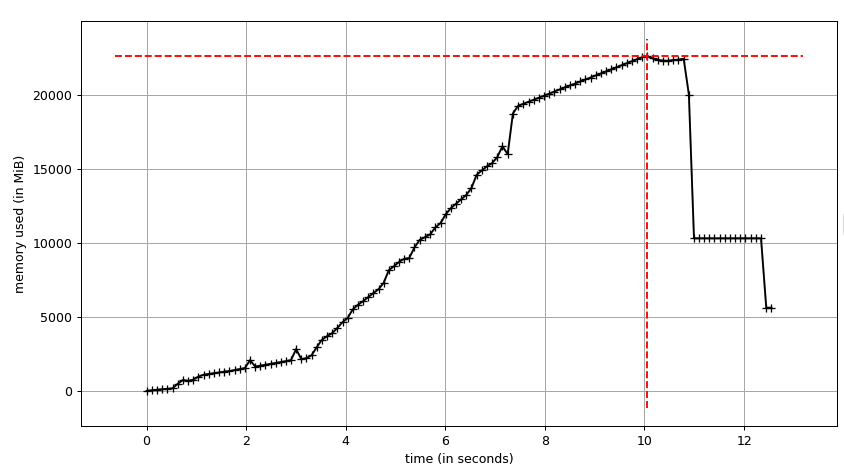

###### Memory characteristic polars_bio_polars_eager

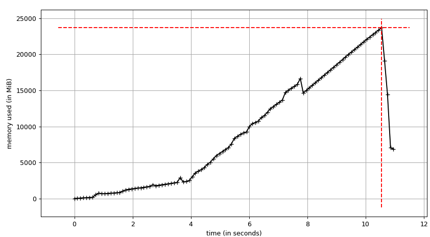

### Intel Emerald Rapids (Linux) 🐧

#### S-size

##### 1-2

| Library                 |  Min (s) |  Max (s) | Mean (s) | Speedup   |
|-------------------------|----------|----------|----------|-----------|
| polars_bio              | 0.044786 | 0.051431 | 0.047491 | 0.75x     |
| polars_bio_pandas_lf    | 0.049655 | 0.053397 | 0.051123 | 0.70x     |
| polars_bio_pandas_pd    | 0.049221 | 0.049408 | 0.049292 | 0.73x     |
| polars_bio_polars_eager | 0.035443 | 0.037997 | 0.036327 | **0.99x** |
| polars_bio_polars_lazy  | 0.035665 | 0.036124 | 0.035831 | **1.00x** |

##### 2-7

| Library                 |  Min (s) |  Max (s) | Mean (s) | Speedup   |
|-------------------------|----------|----------|----------|-----------|
| polars_bio              | 0.121025 | 0.125696 | 0.122869 | 0.88x     |
| polars_bio_pandas_lf    | 0.136112 | 0.146342 | 0.141704 | 0.76x     |
| polars_bio_pandas_pd    | 0.136125 | 0.137920 | 0.137167 | 0.79x     |
| polars_bio_polars_eager | 0.106999 | 0.111473 | 0.108813 | **0.99x** |
| polars_bio_polars_lazy  | 0.107742 | 0.108038 | 0.107885 | **1.00x** |

##### 1-0

| Library                 |  Min (s) |  Max (s) | Mean (s) | Speedup   |
|-------------------------|----------|----------|----------|-----------|
| polars_bio              | 0.180773 | 0.185704 | 0.183153 | 0.91x     |
| polars_bio_pandas_lf    | 0.210633 | 0.217342 | 0.213262 | 0.78x     |
| polars_bio_pandas_pd    | 0.211245 | 0.211972 | 0.211680 | 0.79x     |
| polars_bio_polars_eager | 0.166366 | 0.169000 | 0.167294 | **1.00x** |
| polars_bio_polars_lazy  | 0.166566 | 0.167847 | 0.167033 | **1.00x** |

#### M-size
##### 7-0

| Library                 |  Min (s) |  Max (s) | Mean (s) | Speedup   |
|-------------------------|----------|----------|----------|-----------|
| polars_bio              | 0.306130 | 0.314524 | 0.309803 | **1.00x** |
| polars_bio_pandas_lf    | 0.416123 | 0.432397 | 0.422839 | 0.73x     |
| polars_bio_pandas_pd    | 0.410937 | 0.414566 | 0.412503 | 0.75x     |
| polars_bio_polars_eager | 0.353321 | 0.364626 | 0.358433 | 0.86x     |
| polars_bio_polars_lazy  | 0.355099 | 0.359842 | 0.357666 | 0.87x     |

##### 7-3

| Library                 |  Min (s) |  Max (s) | Mean (s) | Speedup   |
|-------------------------|----------|----------|----------|-----------|
| polars_bio              | 0.283038 | 0.292933 | 0.288120 | **1.00x** |
| polars_bio_pandas_lf    | 0.496220 | 0.510444 | 0.502504 | 0.57x     |
| polars_bio_pandas_pd    | 0.495243 | 0.498179 | 0.497064 | 0.58x     |
| polars_bio_polars_eager | 0.446789 | 0.455552 | 0.450521 | **0.64x** |
| polars_bio_polars_lazy  | 0.450512 | 0.456530 | 0.453931 | 0.63x     |

#### L-size
##### 0-8

| Library                 |   Min (s) |   Max (s) |  Mean (s) | Speedup   |
|-------------------------|-----------|-----------|-----------|-----------|
| polars_bio              |  4.519114 |  4.539367 |  4.532138 | **1.00x** |
| polars_bio_pandas_lf    | 12.710922 | 12.805014 | 12.751166 | 0.36x     |
| polars_bio_pandas_pd    | 12.699757 | 12.820158 | 12.759016 | 0.36x     |
| polars_bio_polars_eager | 12.455788 | 12.555952 | 12.501217 | 0.36x     |
| polars_bio_polars_lazy  | 12.536595 | 12.579006 | 12.561026 | 0.36x     |

##### 4-8

| Library                 |   Min (s) |   Max (s) |  Mean (s) | Speedup   |
|-------------------------|-----------|-----------|-----------|-----------|
| polars_bio              |  6.043839 |  6.129112 |  6.088359 | **1.00x** |
| polars_bio_pandas_lf    | 16.528438 | 16.674857 | 16.605654 | 0.37x     |
| polars_bio_pandas_pd    | 16.575829 | 16.643302 | 16.600709 | 0.37x     |
| polars_bio_polars_eager | 16.177433 | 16.185123 | 16.180217 | 0.38x     |
| polars_bio_polars_lazy  | 16.214009 | 16.395757 | 16.281422 | 0.37x     |

##### 7-8

| Library                 |   Min (s) |   Max (s) |  Mean (s) | Speedup   |
|-------------------------|-----------|-----------|-----------|-----------|
| polars_bio              |  4.600700 |  4.806215 |  4.689799 | **1.00x** |
| polars_bio_pandas_lf    | 19.858977 | 20.342740 | 20.104499 | 0.23x     |
| polars_bio_pandas_pd    | 20.263301 | 20.594552 | 20.402049 | 0.23x     |
| polars_bio_polars_eager | 19.837098 | 20.012580 | 19.922743 | **0.24x** |
| polars_bio_polars_lazy  | 19.803839 | 19.818197 | 19.813257 | **0.24x** |


### Parallel execution
#### Apple Silicon (macOS) 🍎

##### 7-8
| Library                   |  Min (s) |  Max (s) | Mean (s) | Speedup   |
|---------------------------|----------|----------|----------|-----------|
| polars_bio-1              | 2.809130 | 3.025777 | 2.892455 | **1.00x** |
| polars_bio_pandas_lf-1    | 6.113947 | 6.343946 | 6.200402 | 0.47x     |
| polars_bio_pandas_pd-1    | 7.101394 | 7.133803 | 7.121356 | 0.41x     |
| polars_bio_polars_eager-1 | 6.083699 | 6.269502 | 6.188576 | 0.47x     |
| polars_bio_polars_lazy-1  | 6.282692 | 6.359252 | 6.328352 | 0.46x     |
| polars_bio-2              | 1.382220 | 1.489515 | 1.435259 | **2.02x** |
| polars_bio_pandas_lf-2    | 4.088560 | 4.139376 | 4.107673 | 0.70x     |
| polars_bio_pandas_pd-2    | 5.591844 | 5.612861 | 5.603072 | 0.52x     |
| polars_bio_polars_eager-2 | 3.995305 | 4.058894 | 4.020753 | 0.72x     |
| polars_bio_polars_lazy-2  | 3.961027 | 4.047943 | 4.001683 | 0.72x     |
| polars_bio-4              | 1.017920 | 1.077169 | 1.041166 | **2.78x** |
| polars_bio_pandas_lf-4    | 3.084727 | 3.126532 | 3.102596 | 0.93x     |
| polars_bio_pandas_pd-4    | 4.925954 | 4.957415 | 4.943877 | 0.59x     |
| polars_bio_polars_eager-4 | 2.914283 | 2.971686 | 2.935221 | 0.99x     |
| polars_bio_polars_lazy-4  | 2.918793 | 2.944206 | 2.930453 | 0.99x     |
| polars_bio-8              | 0.688430 | 0.751968 | 0.711147 | **4.07x** |
| polars_bio_pandas_lf-8    | 2.558258 | 2.606939 | 2.588139 | **1.12x** |
| polars_bio_pandas_pd-8    | 4.448074 | 4.490866 | 4.474837 | 0.65x     |
| polars_bio_polars_eager-8 | 2.398288 | 2.513702 | 2.446019 | **1.18x** |
| polars_bio_polars_lazy-8  | 2.406907 | 2.418571 | 2.411573 | **1.20x** |


### Memory characteristics
How to run the benchmarks with [memory-profiler](https://github.com/pythonprofilers/memory_profiler):
```bash
(polars-bio-py3.12) ➜  polars-bio git:(master) ✗ pip list | grep memory
memory-profiler            0.61.0

mprof run --include-children benchmark/src/memory/mem_xxx.py
mprof plot mprofile_xxx.dat
```

!!! tip
    1. Here we report end-to-end time, i.e. including reading and writing to a file and all the required operations in between, such as data transformation, Python object creation, etc.


#### Apple Silicon (macOS) 🍎

##### Read Parquet files and count overlaps  7-8
Library      | Peak Memory (MB) | Factor   |
-------------|------------------|----------|
polars-bio   | **14,650**       | **1.0x** |
bioframe     | 35,720           | 2.43x    |
pyranges0    | 30,140           | 2.06x    |
pyranges1    | 35,940           | 2.45x    |


###### polars-bio
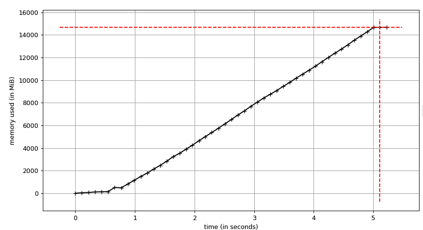
###### bioframe
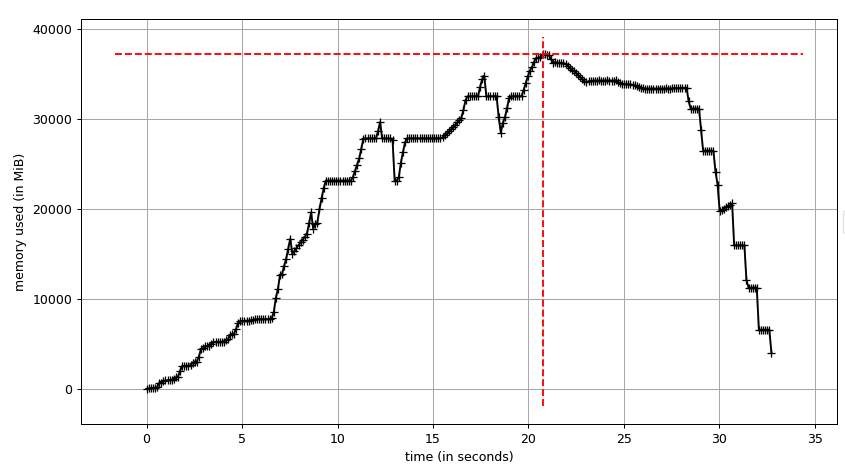
###### pyranges0
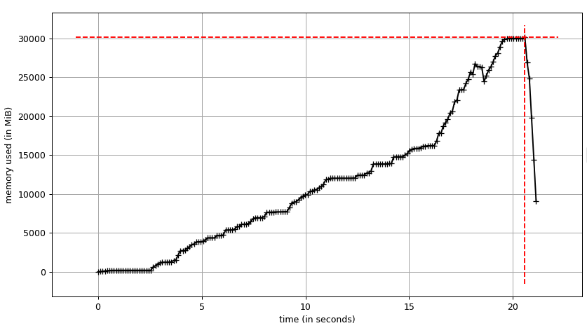
###### pyranges1
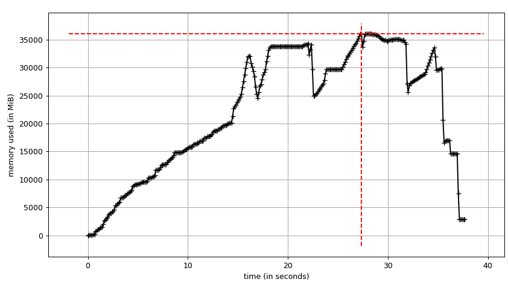

#### Calculate overlaps and export to a CSV file 7-8

| Library               | Time (s)               | Speedup  | Peak Memory (MB) | Factor   |
|-----------------------|------------------------|----------|------------------|----------|
| polars-bio            | **23.765**             | 0.77x    | 14,660           | 26.07x   |
| **polars-bio-stream** | **18.221**<sup>1</sup> | **1.0x** | **562.22**       | **1.0x** |
| bioframe              | 370.010                | 0.05x    | 33,352           | 59.32x   |
| pyranges0             | 275.237                | 0.07x    | 30.052           | 53.45x   |
| pyranges1             | 351.041                | 0.05x    | 36,530           | 64.97x   |

<sup>1</sup> Despite limiting the number of threads in DataFusion (`datafusion.execution.target_partitions=1`) and in Polars (`POLARS_MAX_THREADS=1`) cpu utilization was constant and approx.160%.
###### polars-bio
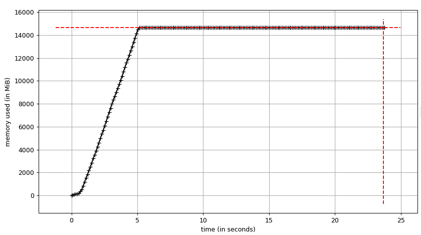

###### polars-bio_stream
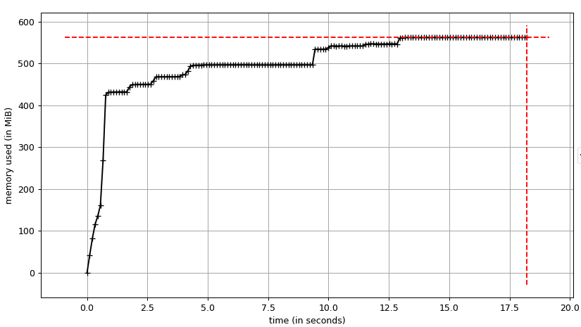

###### bioframe

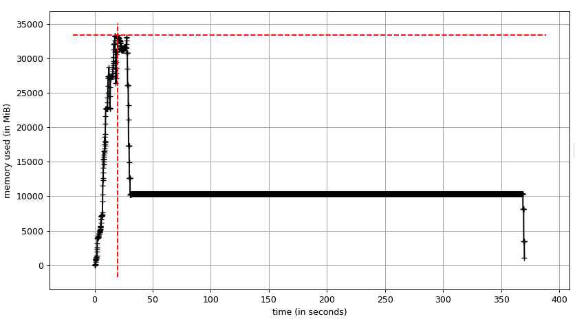

###### pyranges0

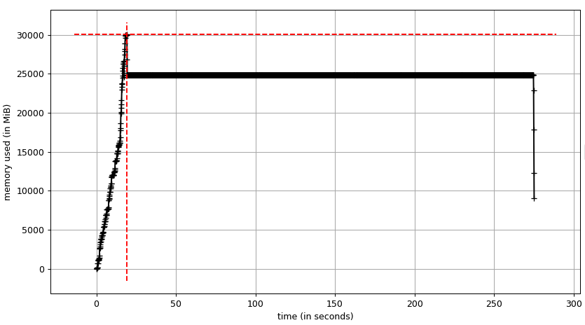
###### pyranges1
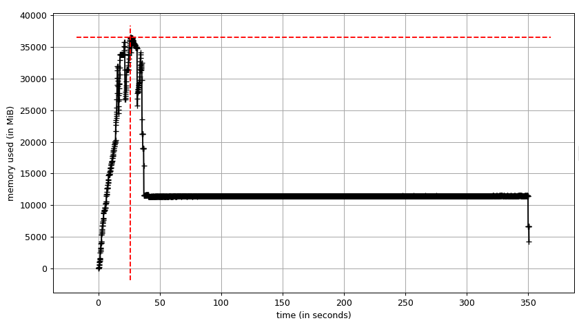

## How to run the benchmarks
Check the [repository](https://github.com/biodatageeks/polars-bio-bench) for more details on how to run the benchmarks.
```

!!! todo
    - Add more details on how to run the benchmarks
